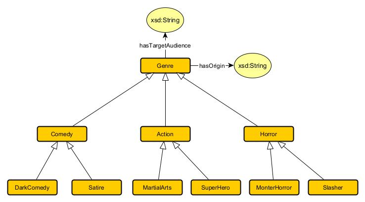
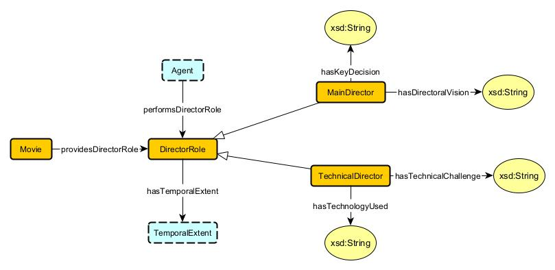
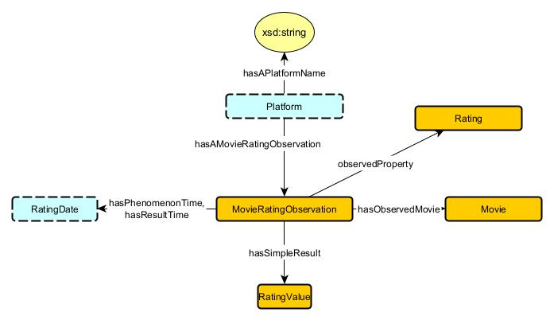
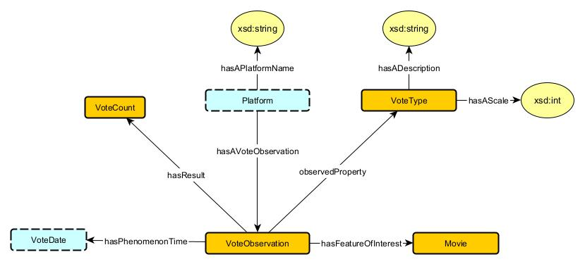
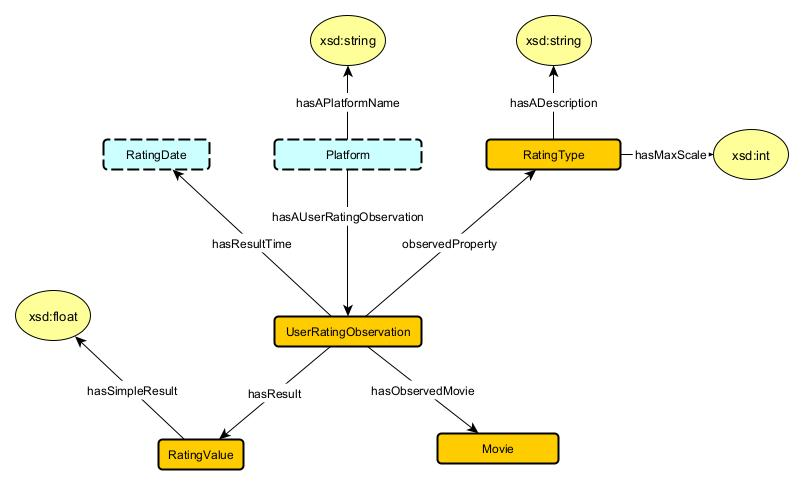
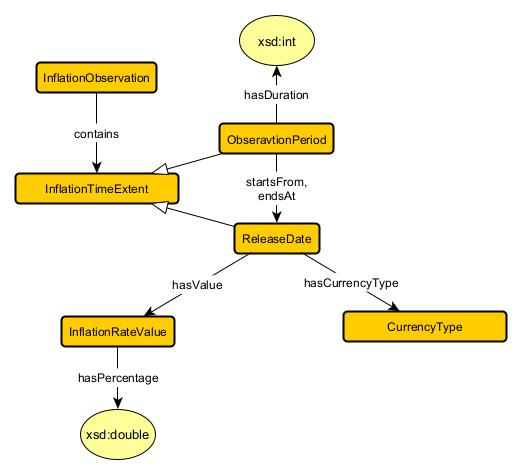

# Movies
Authors : Pooja Sri Tripuraneni, Kedar Sedai, Pujan Bohora

## Use Case Scenario
### Narrative
The rise of streaming platforms and the evolving entertainment industry have created a need for more advanced analytical tools to understand movie performance, audience preferences, and industry trends. A knowledge graph can serve as a powerful tool to explore these dynamics by connecting data points such as actors, directors, budgets, gross earnings, and audience ratings across various datasets. For instance, understanding which actors consistently work with specific directors and how those collaborations impact movie ratings can offer insights for both content creators and marketers. Such relationships are valuable when determining the best talent combinations for future projects.

Additionally, analyzing the correlation between a movie's budget and its gross earnings over different decades provides vital financial insights for studios and producers. This allows them to identify trends in financial performance and adjust budget allocations to maximize profitability. The ability to identify the highest-grossing production companies also supports studios in benchmarking against competitors and assessing which production strategies are most successful.

Countries producing the highest-grossing movies can offer insights into global content trends, highlighting which regions are gaining influence in the global entertainment market. Moreover, understanding the performance of high-budget movies in terms of ratings can guide decision makers in detremining how much investment is worth putting into a project and what returns to expect based on audience response.

Incorporating inflation into these analyses adds a critical economic dimension. Inflation affects various aspects of the movie industry, from production budgets to consumer behavior. Analyzing how inflation impacts production costs over time, particularly in countries with fluctuating economic conditions, provides insights into how studios adapt their strategies during periods of financial uncertainity. Furthermore, understanding whether high inflation correlates with lower gross earnings or changes in audience satisfaction (as reflected in ratings) allows stakeholders to better navigate the dual pressures of creative and financial decision-making. By integrating inflation data into the knowledge graph, studios can assess not only past economic impacts but also forecast future trends for more resilient planning.

### Competency Questions
1. What are the most common genres for movies featuring a specific actor?
2. Which actors have appeared in the most movies directed by specific directors?
3. What is the correlation between a movie's budget and its gross earnings over different decades?
4. Which directors have the highest average movie ratings, and how many votes have those movies received?
5. Which production companies have the highest average gross earnings across all their movies?
6. Which countries produce the highest-grossing movies?
7. Which actors have worked in the highest number of high-budget movies, and how did those movies performs in terms of ratings?
8. How has the inflation rate in each country impacted movie production budgets in that country over time?
9. Is there a relationship between countries with high inflation rates and the gross earnings or profitability of movies produced in those countries?
10. Do changes in inflation affect the average vote or ratings of movies released in those countries over the same period?

### Integrated Datasets
1. [Movie Dataset](../dataset/movie.csv)
2. [Movie Earning Dataset](../dataset/movie_earning.csv)
3. [World GDP Dataset](../dataset/world_gdp_data.csv)

## Modules

### Genre
**Source Pattern :** Classification Pattern (MODL)
**Source Data :** TMDb Movie Dataset, IMDb

#### Description
Genres categorize movies based on themes, storytelling styles, or visual aesthetics, such as Action, Comedy, Drama, and Horror. This classification helps users, producers, and researchers quickly identify movies with similar characteristics, aiding in both searchability and content curation. By organizing films into genres and subgenres, stakeholders can track trends, target specific audiences, and study genre evolution.


#### Axioms
1. Genre → hasTargetAudience → xsd
     * `Genre SubClassOf hasTargetAudience only xsd:String` <br />
          The range of the relationship hasTargetAudience must be xsd:String.

     * `Genre SubClassOf hasTargetAudience some xsd:String` <br />
          Every Genre must have a target audience represented as a string.

     * `Genre SubClassOf ≤1hasTargetAudience` <br />
          Each Genre can have at most one hasTargetAudience relationship.

2. Genre → hasOrigin → xsd
     * `Genre SubClassOf hasOrigin only xsd:String` <br />
          The range of the relationship hasOrigin must be xsd:String.

     * `Genre SubClassOf hasOrigin some xsd:String` <br />
          Every Genre must have an origin represented as a string.

     * `Genre SubClassOf ≤1hasOrigin` <br />
          Each Genre can have at most one hasOrigin relationship.

3. Comedy → Genre
     * `Comedy SubClassOf Genre` <br />
          A Comedy is a subclass of Genre.

4. Action → Genre
     * `Action SubClassOf Genre` <br />
          An Action is a subclass of Genre.

5. Horror → Genre
     * `Horror SubClassOf Genre` <br />
          A Horror is a subclass of Genre.

6. DarkComedy → Comedy
     * `DarkComedy SubClassOf Comedy` <br />
          DarkComedy is a subclass of Comedy.

7. Satire → Comedy
     * `Satire SubClassOf Comedy` <br />
          Satire is a subclass of Comedy.

8. MaritalArts → Action
     * `MartialArts SubClassOf Action` <br />
          MartialArts is a subclass of Action.

9. Superhero → Action
     * `Superhero SubClassOf Action` <br />
          Superhero is a subclass of Action.

10. MonsterHorror → Horror
     * `MonsterHorror SubClassOf Horror` <br />
          MonsterHorror is a subclass of Horror.

11. Slasher → Horror
     * `Slasher SubClassOf Horror` <br />
          Slasher is a subclass of Horror.

12. `Comedy ⊓ Action ⊑ ⊥` <br />
          Comedy and Action are disjoint classes, meaning an entity cannot belong to both classes simultaneously.

13. `Comedy ⊓ Horror ⊑ ⊥` <br />
          Comedy and Horror are disjoint classes.

14. `Action ⊓ Horror ⊑ ⊥` <br />
         Action and Horror are disjoint classes.

15. `DarkComedy ⊓ Satire ⊑ ⊥` <br />
          DarkComedy and Satire are disjoint subclasses of Comedy.

16. `MartialArts ⊓ Superhero ⊑ ⊥` <br />
          MartialArts and Superhero are disjoint subclasses of Action.

17. `MonsterHorror ⊓ Slasher ⊑ ⊥` <br />
          MonsterHorror and Slasher are disjoint subclasses of Horror.

18. `Comedy SubClassOf hasTargetAudience some xsd:String` <br />
          Every Comedy genre must have a target audience.

19. `Action SubClassOf hasOrigin some xsd:String` <br />
          Every Action genre must have an origin.

20. `Horror SubClassOf hasTargetAudience some xsd:String` <br />
          Every Horror genre must have a target audience.

### Actor
**Source Pattern :** Agent Role Pattern
**Source Data :** IMDb, TMDb Movie Dataset

#### Description
Actors bring characters to life and add emotional depth to the storyline, playing an essential role in the viewer's experience. Each actor performs a unique role that directly contributes to the narrative, character development, and overall impact of the movie. Tracking actors as entities with specific roles allows casting and talent management, aiding in analyzing trends in casting, star power, and performance impact.


#### Axioms
1. Movie → providesActorRole → ActorRole <br />
     * `Movie SubClassOf providesActorRole only ActorRole` <br />
          The range of the relationship providesActorRole must be ActorRole.

     * `Movie SubClassOf providesActorRole some ActorRole` <br />
          Every Movie must provide at least one ActorRole.

2. Agent → performsActorRole → ActorRole
     * `ActorRole SubClassOf performsActorRole only Agent` <br />
          The range of the relationship performsActorRole must be Agent.

     * `ActorRole SubClassOf performsActorRole some Agent` <br />
          Every ActorRole must be performed by an Agent.

3. ActorRole → hasTemporalExtent → TemporalExtent
     * `ActorRole SubClassOf hasTemporalExtent only TemporalExtent` <br />
          The range of the relationship hasTemporalExtent must be TemporalExtent.

     * `ActorRole SubClassOf hasTemporalExtent some TemporalExtent` <br />
          Every ActorRole must have a temporal extent specifying time-related details.
     
     * `ActorRole SubClassOf ∀hasTemporalExtent.TemporalExtent` <br />
          All objects of the hasTemporalExtent relationship for ActorRole must be of type TemporalExtent.

4. LeadRole → hasScreenTime → xsd
     * `LeadRole SubClassOf hasScreenTime only xsd:int` <br />
          The range of the relationship hasScreenTime must be xsd:int.

     * `LeadRole SubClassOf hasScreenTime some xsd:int` <br />
          Every LeadRole must have a screen time represented as an integer.

5. LeadRole → hasFanBase → xsd
     * `LeadRole SubClassOf hasFanBase only xsd:String` <br />
          The range of the relationship hasFanBase must be xsd:String.

     * `LeadRole SubClassOf hasFanBase some xsd:String` <br />
          Every LeadRole must have a fan base represented as a string.

6. SupportingRole → hasScreenTime → xsd
     * `SupportingRole SubClassOf hasScreenTime only xsd:int` <br />
          The range of the relationship hasScreenTime must be xsd:int.

     * `SupportingRole SubClassOf hasScreenTime some xsd:int` <br />
          Every SupportingRole must have a screen time represented as an integer.

7. SupportingRole → hasBackStory → xsd
     * `SupportingRole SubClassOf hasBackStory only xsd:String` <br />
          The range of the relationship hasBackStory must be xsd:String.

     * `SupportingRole SubClassOf hasBackStory some xsd:String` <br />
          Every SupportingRole must have a backstory represented as a string.

8. LeadRole → ActorRole
     * `LeadRole SubClassOf ActorRole` <br />
          LeadRole is a subclass of ActorRole.

9. SupportingRole → ActorRole
     * `SupportingRole SubClassOf ActorRole` <br />
          SupportingRole is a subclass of ActorRole.

10. `LeadRole ⊓ SupportingRole ⊑ ⊥` <br />
          LeadRole and SupportingRole are disjoint classes, meaning an entity cannot belong to both classes simultaneously.

### Director
**Source Pattern :** Agent Role Pattern
**Source Data :** IMDb, TMDb Movie Dataset

#### Description
Directors guide the creative vision of a movie, making critical decisions on visual style, pacing, and storytelling. They play a significant role in shaping the film’s artistic and technical aspects, coordinating with cast and crew to achieve the desired outcome. Understanding directors' roles and contributions can help analyze the influence of specific directors on genre trends, box office performance, and critical reception.


#### Axioms
1. Movie → providesDirectorRole → DirectorRole
     * `Movie SubClassOf providesDirectorRole only DirectorRole` <br />
          The range of the relationship providesDirectorRole must be DirectorRole.

     * `Movie SubClassOf providesDirectorRole some DirectorRole` <br />
          Every Movie must provide at least one DirectorRole.

2. Agent → performsDirectorRole → DirectorRole
     * `DirectorRole SubClassOf performsDirectorRole only Agent` <br />
          The range of the relationship performsDirectorRole must be Agent.

     * `DirectorRole SubClassOf performsDirectorRole some Agent` <br />
          Every DirectorRole must be performed by an Agent.

3. DirectorRole → hasTemporalExtent → TemporalExtent
     * `DirectorRole SubClassOf hasTemporalExtent only TemporalExtent` <br />
          The range of the relationship hasTemporalExtent must be TemporalExtent.

     * `DirectorRole SubClassOf hasTemporalExtent some TemporalExtent` <br />
          Every DirectorRole must have a temporal extent specifying its associated time-related details.

4. MainDirector → hasKeyDecision → xsd
     * `MainDirector SubClassOf hasKeyDecision only xsd:String` <br />
          The range of the relationship hasKeyDecision must be xsd:String.

     * `MainDirector SubClassOf hasKeyDecision some xsd:String` <br />
          Every MainDirector must have key decisions represented as strings.

5. MainDirector → hasDirectorialVision → xsd
     * `MainDirector SubClassOf hasDirectorialVision only xsd:String` <br />
          The range of the relationship hasDirectorialVision must be xsd:String.

     * `MainDirector SubClassOf hasDirectorialVision some xsd:String` <br />
          Every MainDirector must have a directorial vision represented as a string.

6. TechnicalDirector → hasTechnologyUsed → xsd
     * `TechnicalDirector SubClassOf hasTechnologyUsed only xsd:String` <br />
          The range of the relationship hasTechnologyUsed must be xsd:String.

     * `TechnicalDirector SubClassOf hasTechnologyUsed some xsd:String` <br />
          Every TechnicalDirector must have technologies used represented as strings.

7. TechnicalDirector → hasTechnicalChallenged → xsd
     * `TechnicalDirector SubClassOf hasTechnicalChallenge only xsd:String` <br />
          The range of the relationship hasTechnicalChallenge must be xsd:String.

     * `TechnicalDirector SubClassOf hasTechnicalChallenge some xsd:String` <br />
          Every TechnicalDirector must have technical challenges represented as strings.

8. MainDirector → DirectorRole
     * `MainDirector SubClassOf DirectorRole` <br />
          A MainDirector is a subclass of DirectorRole.

9. TechnicalDirector → DirectorRole
     * `TechnicalDirector SubClassOf DirectorRole` <br />
          A TechnicalDirector is a subclass of DirectorRole.

10. `MainDirector ⊓ TechnicalDirector ⊑ ⊥` <br />
          MainDirector and TechnicalDirector are disjoint classes, meaning an entity cannot belong to both classes simultaneously.

### Budget
**Source Pattern :** Quantity Pattern
**Source Data :** TMDb Movie Dataset, IMDb

#### Description
A budget outlines the financial resources allocated to various aspects of movie production, such as set design, cast salaries, and marketing. It’s a critical factor in production planning, resource allocation, and financial forecasting. Tracking budget helps in comparing movie scales, forecasting profitability, and assessing financial risk in production investments.


#### Axioms
1. Budget → hasQuantityKind → QuantityKind
     * `Budget SubClassOf hasQuantityKind only QuantityKind` <br />
          The range of the relationship hasQuantityKind must be QuantityKind.

     * `Budget SubClassOf hasQuantityKind some QuantityKind` <br />
          Every Budget must be associated with at least one QuantityKind.

2. Budget → hasQuantityValue → QuantityValue
     * `Budget SubClassOf hasQuantityValue only QuantityValue` <br />
          The range of the relationship hasQuantityValue must be QuantityValue.

     * `Budget SubClassOf hasQuantityValue some QuantityValue` <br />
          Every Budget must have at least one QuantityValue.

     * `Budget ⊓ QuantityValue ⊑ ⊥` <br />
            Budget and QuantityValue are disjoint classes, meaning an entity cannot belong to both classes simultaneously.

3. QuantityValue → hasUnit → Unit
     * `QuantityValue SubClassOf hasUnit only Unit` <br />
          The range of the relationship hasUnit must be Unit.

     * `QuantityValue SubClassOf hasUnit some Unit` <br />
          Every QuantityValue must have a unit associated with it.

4. QuantityValue → hasNumericValue → xsd
     * `QuantityValue SubClassOf hasNumericValue only xsd:double` <br />
          The range of the relationship hasNumericValue must be xsd:double.

     * `QuantityValue SubClassOf hasNumericValue some xsd:double` <br />
          Every QuantityValue must have a numeric value represented as a double.

     * `QuantityValue SubClassOf ∀hasNumericValue.xsd:double` <br />
          All objects of the hasNumericValue relationship for QuantityValue must be of type xsd:double.

5. `QuantityKind ⊓ Unit ⊑ ⊥` <br />
        QuantityKind and Unit are disjoint classes, meaning an entity cannot belong to both classes simultaneously.

6. `Budget SubClassOf ⊤` <br />
        Budget is a class that exists as a superclass for other relationships.

### Gross Earnings
**Source Pattern :** Quantity Pattern
**Source Data :** TMDb Movie Dataset, IMDb

#### Description
Gross earnings represent the total revenue generated by a movie from box office sales, streaming, and other distribution channels. It’s a key indicator of financial success and return on investment, often used for comparisons across movies, studios, and time periods. This data aids in analyzing revenue performance, industry profitability, and consumer demand.


#### Axioms
1. GrossEarnings → hasEarningsValue → EarningsValue
     * `GrossEarnings SubClassOf hasEarningsValue only EarningsValue` <br />
          The range of the relationship hasEarningsValue must be EarningsValue.

     * `GrossEarnings SubClassOf hasEarningsValue some EarningsValue` <br />
          Every GrossEarnings must have at least one associated EarningsValue.

2. GrossEarnings → hasEarningsType → EarningsType
     * `GrossEarnings SubClassOf hasEarningsType only EarningsType` <br />
          The range of the relationship hasEarningsType must be EarningsType.

     * `GrossEarnings SubClassOf hasEarningsType some EarningsType` <br />
          Every GrossEarnings must have an associated EarningsType.

3. EarningsValue → hasNumericValue → xsd
     * `EarningsValue SubClassOf hasNumericValue only xsd:int` <br />
          The range of the relationship hasNumericValue must be xsd:int.

     * `EarningsValue SubClassOf hasNumericValue some xsd:int` <br />
          Every EarningsValue must have a numeric value represented as an integer.

4. EarningsValue → hasCurrency → Currency
     * `EarningsValue SubClassOf hasCurrency only Currency` <br />
          The range of the relationship hasCurrency must be Currency.

     * `EarningsValue SubClassOf hasCurrency some Currency` <br />
          Every EarningsValue must have an associated Currency.

### Movie Ratings
**Source Pattern :** Observation Pattern
**Source Data :** TMDb Movie Dataset, IMDb

#### Description
Ratings offer a standardized assessment of movie quality or appeal, typically provided by critics or rating boards. Ratings can influence audience decisions, marketing strategies, and awards eligibility. Capturing movie ratings helps analyze critical reception, audience expectations, and the impact of reviews on box office success.


#### Axioms
1. MovieRatingObservation → hasPhenomenonTime/hasResultTime → RatingDate
     * `MovieRatingObservation SubClassOf hasPhenomenonTime only RatingDate` <br />
          The range of the relationship hasPhenomenonTime must be RatingDate.

     * `MovieRatingObservation SubClassOf hasPhenomenonTime some RatingDate` <br />
          Every MovieRatingObservation must have at least one hasPhenomenonTime linked to a RatingDate.

     * `MovieRatingObservation SubClassOf hasResultTime only RatingDate` <br />
          The range of the relationship hasResultTime must be RatingDate.

     * `MovieRatingObservation SubClassOf hasResultTime some RatingDate` <br />
          Every MovieRatingObservation must have have at least one hasResultTime linked to a RatingDate.

2. MovieRatingObservation → providedByPlatform → Platform
     * `MovieRatingObservation SubClassOf providedByPlatform only Platform` <br />
          The range of the relationship providedByPlatform must be Platform.
     
     * `MovieRatingObservation SubClassOf providedByPlatform some Platform` <br />
          Every MovieRatingObservation must be linked to at least one Platform.

3. MovieRatingObservation → observedProperty → Rating
     * `MovieRatingObservation SubClassOf observedProperty only Rating` <br />
          The range of the relationship observedProperty must be Rating.

     * `MovieRatingObservation SubClassOf observedProperty some Rating` <br />
          Every MovieRatingObservation must observe at least one Rating.

4. MovieRatingObservation → hasObservedMovie → Movie
     * `MovieRatingObservation SubClassOf hasObservedMovie only Movie` <br />
          The range of the relationship hasObservedMovie must be Movie.

     * `MovieRatingObservation SubClassOf hasObservedMovie some Movie` <br />
          Every MovieRatingObservation must observe at least one Movie.

5. MovieRatingObservation → hasSimpleResult → RatingValue
     * `MovieRatingObservation SubClassOf hasSimpleResult only RatingValue` <br />
          The range of the relationship hasSimpleResult must be RatingValue.

     * `MovieRatingObservation SubClassOf hasSimpleResult some RatingValue` <br />
          Every MovieRatingObservation must have at least one simple result as a RatingValue.

6. `RatingDate ⊓ Platform ⊑ ⊥` <br />
     RatingDate and Platform are disjoint classes, meaning an entity cannot belong to both classes simultaneously.
     
### Votes
**Source Pattern :** Observation Pattern
**Source Data :** TMDb Movie Dataset, IMDb

#### Description
Votes provide a quantitative measure of audience engagement, typically reflecting popularity or user approval on platforms. High vote counts indicate high interest or engagement, providing insights into a movie's popularity and social influence. This metric helps measure audience reach, social impact, and viewer sentiment. 


#### Axioms
1. VoteObservation → hasPhenomenonTime → VoteDate
     * `VoteObservation SubClassOf hasPhenomenonTime only VoteDate` <br />
          The range of the relationship hasPhenomenonTime must be VoteDate.

     * `VoteObservation SubClassOf hasPhenomenonTime some VoteDate` <br />
          Every VoteObservation must have at least one hasPhenomenonTime linked to a VoteDate.

2. VoteObservation → providedByPlatform → Platform
     * `VoteObservation SubClassOf providedByPlatform only Platform` <br />
          The range of the relationship providedByPlatform must be Platform.

     * `VoteObservation SubClassOf providedByPlatform some Platform` <br />
          Every VoteObservation must be linked to at least one Platform.

3. VoteObservation → observedProperty → VoteType
     * `VoteObservation SubClassOf observedProperty somy VoteType` <br />
          The range of the relationship observedProperty must be VoteType.

     * `VoteObservation SubClassOf observedProperty some VoteType` <br />
          Every VoteObservation must observe at least one VoteType.

4. VoteObservation → hasFeatureOfInterest → Movie
     * `VoteObservation SubClassOf hasFeatureOfInterest only Movie` <br />
          The range of the relationship hasFeatureOfInterest must be Movie.

     * `VoteObservation SubClassOf hasFeatureOfInterest some Movie` <br />
          Every VoteObservation must observe at least one Movie as its feature of interest.

5. VoteObservation → hasResult → VoteCount
     * `VoteObservation SubClassOf hasResult only VoteCount` <br />
          The range of the relationship hasResult must be VoteCount.

     * `VoteObservation SubClassOf hasResult some VoteCount` <br />
          Every VoteObservation must have at least one result represented as a VoteCount.

6. Platform → hasAPlatformName → xsd
     * `Platform SubClassOf hasAPlatformName only xsd:string` <br />
          The range of the relationship hasAPlatformName must be of type xsd:string.

     * `Platform SubClassOf hasAPlatformName some xsd:String` <br />
          Every Platform must have a name represented as a string.

7. VoteType → hasADescription → xsd
     * `VoteType SubClassOf hasADescription only xsd:string` <br />
          The range of the relationship hasADescription must be of type xsd:string.

     * `VoteType SubClassOf hasADescription some xsd:string` <br />
          Every VoteType must have a description represented as a string.

8. VoteType → hasAScale → xsd
     * `VoteType SubClassOf hasAScale only xsd:int` <br />
          The range of the relationship hasAScale must be of type xsd:int.

     * `VoteType SubClassOf hasAScale some xsd:int` <br />
          Every VoteType must have a scale represented as an integer.

9. `VoteDate ⊓ Platform ⊑ ⊥` <br />
          VoteDate and Platform are disjoint classes, meaning an entity cannot belong to both classes simultaneously.

10. `VoteCount ⊓ Movie ⊑ ⊥` <br />
          VoteCount and Movie are disjoint classes, meaning an entity cannot belong to both classes simultaneously.

### Production Companies
**Source Pattern :** Agent Role Pattern
**Source Data :** TMDb Movie Dataset, IMDb

#### Description
Production companies finance, manage, and oversee movie production. They coordinate resources, talent, and logistics, playing a central role in bringing movies to life. Tracking production companies helps in identifying industry leaders, partnerships, and investment patterns, as well as analyzing the impact of specific companies on genre trends or movie success.


#### Axioms
1. Movie → providesProductionRole → ProductionRole
     * `Movie SubClassOf providesProductionRole only ProductionRole` <br />
          The range of the relationship providesProductionRole must be ProductionRole.

     * `Movie SubClassOf providesProductionRole some ProductionRole` <br />
          Every Movie must provide at least one ProductionRole.

2. ProductionRole → hasTemporalExtent → ProductionPeriod
     * `ProductionRole SubClassOf hasTemporalExtent only ProductionPeriod` <br />
          The range of the relationship hasTemporalExtent must be ProductionPeriod.

     * `ProductionRole SubClassOf hasTemporalExtent some ProductionPeriod` <br />
          Every ProductionRole must have a temporal extent specifying its associated ProductionPeriod.

3. Agent → performsAgentRole → ProductionRole
     * `ProductionRole SubClassOf performedBy only Agent` <br />
          The range of the relationship performedBy must be Agent.

     * `ProductionRole SubClassOf performedBy some Agent` <br />
          Every ProductionRole must be performed by an Agent.

4. ExecutiveProducer → hasFinancialContribution → xsd
     * `ExecutiveProducer SubClassOf hasFinancialContribution only xsd:int` <br />
          The range of the relationship hasFinancialContribution must be xsd:int.

     * `ExecutiveProducer SubClassOf hasFinancialContribution some xsd:int` <br />
          Every ExecutiveProducer must have a financial contribution represented as an integer.

5. ExecutiveProducer → hasCreativeControl → xsd
     * `ExecutiveProducer SubClassOf hasCreativeControl only xsd:String` <br />
          The range of the relationship hasCreativeControl must be xsd:String.

     * `ExecutiveProducer SubClassOf hasCreativeControl some xsd:String` <br />
          Every ExecutiveProducer must have creative control represented as a string.

6. ExecutiveDirector → hasContractTerms → xsd
     * `ExecutiveProducer SubClassOf hasContractTerms only xsd:int` <br />
          The range of the relationship hasContractTerms must be xsd:int.

     * `ExecutiveProducer SubClassOf hasContractTerms some xsd:int` <br />
          Every ExecutiveProducer must have contract terms represented as an integer.

7. Distribution → hasRevenueSharePercentage → xsd
     * `Distribution SubClassOf hasRevenueSharePercentage only xsd:int` <br />
          The range of the relationship hasRevenueSharePercentage must be xsd:int.

     * `Distribution SubClassOf hasRevenueSharePercentage some xsd:int` <br />
          Every Distribution must have a revenue share percentage represented as an integer.

8. Distribution → hasDistributionRegion → xsd
     * `Distribution SubClassOf hasDistributionRegion only xsd:String` <br />
          The range of the relationship hasDistributionRegion must be xsd:String.

     * `Distribution SubClassOf hasDistributionRegion some xsd:String` <br />
          Every Distribution must have a distribution region represented as a string.

9. Distribution → hasReleasePlatforms → xsd
     * `Distribution SubClassOf hasReleasePlatforms only xsd:String` <br />
          The range of the relationship hasReleasePlatforms must be xsd:String.

     * `Distribution SubClassOf hasReleasePlatforms some xsd:String` <br />
          Every Distribution must have release platforms represented as a string.

### Country
**Source Pattern :** Place Pattern (GeoSPARQL)
**Source Data :** IMDb, TMDb Dataset

#### Description
The country provides geographic context, showing where a movie was produced, filmed, or released. This information can be important for understanding cultural influences, market targeting, and regional distribution strategies.


#### Axioms
1. ProductionCompany → basedIn → Place
     * `ProductionCompany SubClassOf basedIn only Place` <br />
          The range of the relationship basedIn must be Place.

     * `ProductionCompany SubClassOf basedIn some Place` <br />
          Every ProductionCompany must have a base location represented as a Place.

2. Movie → hasFilmingLocation → Place
     * `Movie SubClassOf hasFilmingLocation only Place` <br />
          The range of the relationship hasFilmingLocation must be Place.

     * `Movie SubClassOf hasFilmingLocation some Place` <br />
          Every Movie must have at least one filming location represented by a Place.

3. City → Place
     * `Place SubClassOf hasCity only City` <br />
          The range of the relationship hasCity must be City.

     * `Place SubClassOf hasCity some City` <br />
          Every Place must be associated with at least one City.

     * `City SubClassOf Place` <br />
          A City is a subclass of Place.

4. City → hasName → xsd
     * `City SubClassOf hasName only xsd:String` <br />
          The range of the relationship hasName must be xsd:String.

     * `City SubClassOf hasName some xsd:String` <br />
          Every City must have a name represented as a string.

     * `City SubClassOf ∀hasName.xsd:String` <br />
          All objects of the hasName relationship for City must be of type xsd:String.


5. Person → isACitizenOf → Country
     * `Person SubClassOf isACitizenOf only Country` <br />
          The range of the relationship isACitizenOf must be Country.

     * `Person SubClassOf isACitizenOf some Country` <br />
          Every Person must be a citizen of at least one Country.

6. Country → hasCity → City
     * `Country SubClassOf hasCity only City` <br />
          The range of the relationship hasCity must be City.

     * `Country SubClassOf hasCity some City` <br /> 
          Every Country must have at least one associated City.

     * `City ⊓ Country ⊑ ⊥` <br />
          City and Country are disjoint classes, meaning an entity cannot belong to both classes simultaneously.

7. Country → Place
     * `Country SubClassOf Place` <br />
          A Country is a subclass of Place.

8. `ProductionCompany ⊓ Movie ⊑ ⊥` <br />
          ProductionCompany and Movie are disjoint classes, meaning an entity cannot belong to both classes simultaneously.

### User Ratings
**Source Pattern :** Observation Pattern
**Source Data :** TMDb Movie Dataset, IMDb

#### Description
User ratings reflect individual viewers' assessments of a movie's quality or appeal, based on personal experience. They provide insight into audience satisfaction, influencing future viewers and marketing strategies. User ratings help analyze audience sentiment, compare critical versus audience reception, and measure long-term appeal.


#### Axioms
1. UserRatingObservation → hasResultTime → RatingDate
     * `UserRatingObservation SubClassOf hasResultTime only RatingDate` <br />
          The ramge of the relationship hasResultTime must be RatingDate.

     * `UserRatingObservation SubClassOf hasResultTime some RatingDate` <br />
          Every UserRatingObservation must have at least one hasResultTime linked to a RatingDate.

2. UserRatingObservation → providedByPlatform → Platform
     * `UserRatingObservation SubClassOf providedByPlatform only Platform` <br />
           The range of the relationship providedByPlatform must be Platform.

     * `UserRatingObservation SubClassOf providedByPlatform some Platform` <br />
          Every UserRatingObservation must be linked to at least one Platform.

3. UserRatingObservation → observedProperty → RatingType
     * `UserRatingObservation SubClassOf observedProperty only RatingType` <br />
          The range of the relationship observedProperty must be RatingType.

     * `UserRatingObservation SubClassOf observedProperty some RatingType` <br />
          Every UserRatingObservation must observe at least one RatingType.

4. UserRatingObservation → hasObservedMovie → Movie
     * `UserRatingObservation SubClassOf hasObservedMovie only Movie` <br />
          The range of the relationship hasObservedMovie must be Movie.

     * `UserRatingObservation SubClassOf hasObservedMovie some Movie` <br />
          Every UserRatingObservation must observe at least one Movie.

5. UserRatingObservation → hasSimpleResult → RatingValue
     * `UserRatingObservation SubClassOf hasSimpleResult only RatingValue` <br />
          The range of the relationship hasSimpleResult must be RatingValue.

     * `UserRatingObservation SubClassOf hasSimpleResult some RatingValue` <br />
          Every UserRatingObservation must have at least one simple result as a RatingValue.

6. Platform → hasAPlatformName → xsd
     * `Platform SubClassOf hasAPlatformName only xsd:string` <br />
          The range of the relationship hasAPlatformName must be of type xsd:string.

     * `Platform SubClassOf hasAPlatformName some xsd:string` <br />
          Every Platform must have a name represented as a string.

7. RatingType → hasADescription → xsd
     * `RatingType SubClassOf hasADescription only xsd:string` <br />
          The range of the relationship hasADescription must be of type xsd:string.

     * `RatingType SubClassOf hasADescription some xsd:string` <br />
          Every RatingType must have a description represented as a string.

8. RatingType → hasMaxScale → xsd
     * `RatingType SubClassOf hasMaxScale only xsd:int` <br />
          The range of the relationship hasMaxScale must be of type xsd:int.

     * `RatingType SubClassOf hasMaxScale some xsd:int` <br />
          Every RatingType must have a maximum scale represented as an integer.

9. RatingValue → hasSimpleResult → xsd
     * `RatingValue SubClassOf hasSimpleResult only xsd:float` <br />
          The range of the relationship hasSimpleResult must be of type xsd:float.

     * `RatingValue SubClassOf hasSimpleResult some xsd:float` <br />
          Every RatingValue must have a result represented as a float.

10. `RatingDate ⊓ Platform ⊑ ⊥` <br />
          RatingDate and Platform are disjoint classes, meaning an entity cannot belong to both classes simultaneously.

11. `Movie ⊓ Platform ⊑ ⊥` <br />
          Movie and Platform are disjoint classes, meaning an entity cannot belong to both classes simultaneously.

### Inflation
**Source Pattern :** Temporal Extent Pattern
**Source Data :** Global Inflation Dataset, TMDb Movie Dataset, IMDb

#### Description
Inflation impacts production costs, ticket prices, and revenue over time, affecting the profitability and financial planning of movies. By understanding inflation trends, studios can adjust budgets, pricing, and investment strategies accordingly. This data aids in analyzing long-term financial performance and economic influence on production decisions.


#### Axioms
1. InflationObservation → contains → InflationTimeExtent
     * `InflationObservation SubClassOf contains only InflationTimeExtent` <br />
          The range of the relationship contains must be InflationTimeExtent.

     * `InflationObservation SubClassOf contains some InflationTimeExtent` <br />
          Every InflationObservation must contain at least one InflationTimeExtent.

2. ObservationPeriod → InflationTimeExtent
     * `InflationTimeExtent SubClassOf hasDuration only ObservationPeriod` <br />
          The range of the relationship hasDuration must be ObservationPeriod.

3.   *  `InflationTimeExtent SubClassOf hasDuration some ObservationPeriod`<br>
          Every `InflationTimeExtent` must have a duration represented by an `ObservationPeriod`.

3. ObservationPeriod → startsFrom → ReleaseDate
     * `ObservationPeriod SubClassOf startsFrom only ReleaseDate` <br />
          The range of the relationship startsFrom must be ReleaseDate.

4. ObservationPeriod → endsAt → ReleaseDate
     * `ObservationPeriod SubClassOf endsAt only ReleaseDate` <br />
          The range of the relationship endsAt must be ReleaseDate.

     *  `ObservationPeriod SubClassOf startsFrom some ReleaseDate and endsAt some ReleaseDate`<br>
          Every `ObservationPeriod` must have a starting and an ending point represented by `ReleaseDate`.

     *  `InflationTimeExtent SubClassOf hasValue only InflationRateValue`<br>
          The range of the relationship `hasValue` must be `InflationRateValue`.

     *  `InflationTimeExtent SubClassOf hasValue some InflationRateValue`<br>
          Every `InflationTimeExtent` must have a value represented by an `InflationRateValue`.

6. InflationRateValue → hasPercentage → xsd
     * `InflationRateValue SubClassOf hasPercentage only xsd:double` <br />
          The range of the relationship hasPercentage must be xsd:double.

     * `InflationRateValue SubClassOf hasPercentage some xsd:double` <br />
          Every InflationRateValue must have a percentage represented as a double.

7. ReleaseDate → hasReferenceSystem → CurrencyReferenceSyatem
     * `ReleaseDate SubClassOf hasReferenceSystem only CurrencyReferenceSystem` <br />
          The range of the relationship hasReferenceSystem must be CurrencyReferenceSystem.

     * `ReleaseDate SubClassOf hasReferenceSystem some CurrencyReferenceSystem` <br />
          Every ReleaseDate must have a reference system associated with a CurrencyReferenceSystem.


### Validation

**Competency Question 1 :** "What are the most common genres for movies featuring a specific actor?"

**Bridged Datasets :** movie.csv, movie_earning.csv

**SPARQL Query :**
```
PREFIX xsd: <http://www.w3.org/2001/XMLSchema#>
PREFIX movies: <http://example.org/movies/>
PREFIX earnings: <http://example.org/earnings/>
PREFIX inflation: <http://example.org/inflation/>

#CQ1
SELECT ?genre (COUNT(?movie) AS ?movieCount)
WHERE {
  ?movie a movies:Movie ;
         movies:hasActor movies:Actor.Andrew_Hawley ;
         movies:hasGenre ?genre .
  		 
}
GROUP BY ?genre
ORDER BY DESC(?movieCount)
LIMIT 5
```

**Output :**


**Competency Question 2 :** "Which actors have appeared in the most movies directed by specific directors?"

**Bridged Datasets :** movie.csv, movie_earning.csv

**SPARQL Query :**
```
PREFIX xsd: <http://www.w3.org/2001/XMLSchema#>
PREFIX movies: <http://example.org/movies/>
PREFIX earnings: <http://example.org/earnings/>
PREFIX inflation: <http://example.org/inflation/>
SELECT ?actor (COUNT(?movie) AS ?movieCount)
WHERE {
  ?movie a movies:Movie ;
         movies:hasDirector movies:Director.Christopher_Nolan ; 
         movies:hasActor ?actor .
}
GROUP BY ?actor
ORDER BY DESC(?movieCount)
LIMIT 10
```

**Output :**


**Competency Question 3 :** "What is the correlation between a movie's budget and its gross earnings over different decades?"

**Bridged Datasets :** movie.csv, movie_earning.csv

**SPARQL Query :** 
```
PREFIX xsd: <http://www.w3.org/2001/XMLSchema#>
PREFIX movies: <http://example.org/movies/>
PREFIX earnings: <http://example.org/earnings/>
PREFIX inflation: <http://example.org/inflation/>
SELECT ?decade (AVG(xsd:float(?budget)) AS ?averageBudget) (AVG(xsd:float(?gross_earning)) AS ?averageGrossEarnings)
WHERE {
  ?movie a movies:Movie ;
         movies:year ?year ;
         earnings:budget ?budget ;
         earnings:gross_earning ?gross_earning .
  BIND (FLOOR(xsd:integer(?year) / 10) * 10 AS ?decade)
}
GROUP BY ?decade
ORDER BY ?decade
```

**Output :**


**Competency Question 4 :** "Which directors have the highest average movie ratings, and how many votes have those movies received?"

**Bridged Datasets :** movie.csv, movie_earning.csv

**SPARQL Query :**
```
PREFIX xsd: <http://www.w3.org/2001/XMLSchema#>
PREFIX movies: <http://example.org/movies/>
PREFIX earnings: <http://example.org/earnings/>
PREFIX inflation: <http://example.org/inflation/>
SELECT ?director (AVG(xsd:float(?rating)) AS ?averageRating) (SUM(xsd:integer(?votes)) AS ?totalVotes)
WHERE {
  ?movie a movies:Movie ;
         movies:hasDirector ?director ;
         movies:avg_vote ?rating ;
         movies:votes ?votes .
}
GROUP BY ?director
ORDER BY DESC(?averageRating)
LIMIT 10
```

**Output :**


**Competency Question 5 :** "Which production companies have the highest average gross earnings across all their movies?"

**Bridged Datasets :** movie.csv, movie_earning.csv

**SPARQL Query :**
```
PREFIX xsd: <http://www.w3.org/2001/XMLSchema#>
PREFIX movies: <http://example.org/movies/>
PREFIX earnings: <http://example.org/earnings/>
PREFIX inflation: <http://example.org/inflation/>
SELECT ?company (AVG(xsd:float(?gross_earning)) AS ?averageGrossEarnings)
WHERE {
  ?movie a earnings:Movie ;
         earnings:company ?company ;
         earnings:gross_earning ?gross_earning .
}
GROUP BY ?company
ORDER BY DESC(?averageGrossEarnings)
LIMIT 10
```

**Output :**


**Competency Question 6 :** "Which countries produce the highest-grossing movies?"

**Bridged Datasets :** movie.csv, movie_earning.csv

**SPARQL Query :**
```
PREFIX xsd: <http://www.w3.org/2001/XMLSchema#>
PREFIX movies: <http://example.org/movies/>
PREFIX earnings: <http://example.org/earnings/>
PREFIX inflation: <http://example.org/inflation/>
SELECT ?country (SUM(xsd:float(?gross_earning)) AS ?totalGrossEarnings)
WHERE {
  ?movie a movies:Movie ;
         movies:country ?country ;
         earnings:gross_earning ?gross_earning .
}
GROUP BY ?country
ORDER BY DESC(?totalGrossEarnings)
LIMIT 10
```

**Output :**


**Competency Question 7 :** "Which actors have worked in the highest number of high-budget movies, and how did those movies perform in terms of ratings?"

**Bridged Datasets :** movie.csv, movie_earning.csv

**SPARQL Query :** 
```
PREFIX xsd: <http://www.w3.org/2001/XMLSchema#>
PREFIX movies: <http://example.org/movies/>
PREFIX earnings: <http://example.org/earnings/>
PREFIX inflation: <http://example.org/inflation/>
SELECT ?actor (COUNT(?movie) AS ?highBudgetMovies) (AVG(xsd:float(?rating)) AS ?averageRating)
WHERE {
  ?movie a movies:Movie ;
         movies:hasActor ?actor ;
         earnings:budget ?budget ;
         movies:avg_vote ?rating .
  FILTER(xsd:float(?budget) > 10000000)  # Define high-budget threshold
}
GROUP BY ?actor
ORDER BY DESC(?highBudgetMovies)
LIMIT 10
```

**Output :** 


**Competency Question 8 :** "How has the inflation rate in each country impacted movie production budgets in that country over time?"

**Bridged Datasets :** movie.csv, movie_earning.csv, world_gdp_data.csv

**SPARQL Query :**
```
PREFIX xsd: <http://www.w3.org/2001/XMLSchema#>
PREFIX movies: <http://example.org/movies/>
PREFIX earnings: <http://example.org/earnings/>
PREFIX inflation: <http://example.org/inflation/>
SELECT ?country ?year (AVG(xsd:float(?budget)) AS ?averageBudget) (AVG(xsd:float(?inflationRate)) AS ?averageInflationRate)
WHERE {
  ?movie a movies:Movie ;
         movies:country ?country ;
         movies:year ?year ;
         earnings:budget ?budget .

  # Handle inflation rate specifically for 2019
  OPTIONAL {
    ?country inflation:2019 ?inflationRate .
    FILTER(?year = 2019)
  }
}
GROUP BY ?country ?year
HAVING (?year = 2019)
ORDER BY ?country
```

**Output :**


**Competency Question 9 :** "Is there a relationship between countries with high inflation rates and the gross earnings or profitability of movies produced in those countries?"

**Bridged Datasets :** movie.csv, movie_earning.csv, world_gdp_data.csv

**SPARQL Query :**
```
PREFIX xsd: <http://www.w3.org/2001/XMLSchema#>
PREFIX movies: <http://example.org/movies/>
PREFIX earnings: <http://example.org/earnings/>
PREFIX inflation: <http://example.org/inflation/>
SELECT ?country (AVG(xsd:float(?gross_earning)) AS ?averageGrossEarnings) (AVG(xsd:float(?inflationRate)) AS ?averageInflationRate)
WHERE {
  ?movie a movies:Movie ;
         movies:country ?country ;
         earnings:gross_earning ?gross_earning ;
         movies:year ?year .

  # Handle inflation data for specific years
  OPTIONAL {
    ?country inflation:2019 ?rate2019 .
    FILTER(?year = 2019)
    BIND(?rate2019 AS ?inflationRate)
  }
  OPTIONAL {
    ?country inflation:2020 ?rate2020 .
    FILTER(?year = 2020)
    BIND(?rate2020 AS ?inflationRate)
  }
}
GROUP BY ?country
ORDER BY DESC(?averageInflationRate)
```

**Output :**


**Competency Question 10 :** "Do changes in inflation affect the average vote or ratings of movies released in those countries over the same period?"

**Bridged Datasets :** movie.csv, movie_earning.csv, world_gdp_data.csv

**SPARQL Query :**
```
PREFIX xsd: <http://www.w3.org/2001/XMLSchema#>
PREFIX movies: <http://example.org/movies/>
PREFIX earnings: <http://example.org/earnings/>
PREFIX inflation: <http://example.org/inflation/>
SELECT ?country ?year (AVG(xsd:float(?avgVote)) AS ?averageRating) (AVG(xsd:float(?inflationRate)) AS ?averageInflationRate)
WHERE {
  ?movie a movies:Movie ;
         movies:country ?country ;
         movies:year ?year ;
         movies:avg_vote ?avgVote ;
         movies:inflation_rate ?inflationRate .
}
GROUP BY ?country ?year
ORDER BY ?country ?year
```

**Output :**


