**Actor** 
     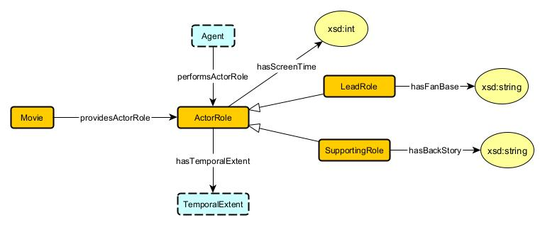

1.  `ActorRole SubClass Of AgentRole`   
     Actor roles are a type of agent role.   

2.  `providesActorRole exactly 1 ActorRole`   
     Each movie provides exactly one actor role.   
 
3.  `hasTemporalExtent exactly 1 TemporalExtent`   
     Each actor role has exactly one temporal extent.   

4.  `LeadRole SubClass Of ActorRole SupportingRole SubClass Of ActorRole`   
     Lead and supporting roles are specific types of actor roles   

5.  `hasScreenTime exactly 1 xsd:int`   
     Both lead and supporting roles have exactly one screen time attribute of type integer.   

6.  `hasFanBase exactly 1 xsd:String`   
     Each lead role has exactly one fan base attribute of type string.   

7. `hasBackStory exactly 1 xsd:String`   
    Each supporting role has exactly one backstory attribute of type string.   

8.  `performsActorRole Domain Agent`   
     Actor roles are defined within the context of agents.   

9.  `providesActorRole Domain Movie`   
     The Movie entity has a mandatory relationship with ActorRole.   

**Budget** 
    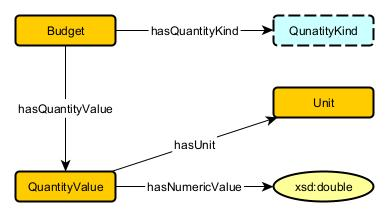

1. `Budget hasQuantityValue exactly 1 QuantityValue`  
    Every Budget has exactly one QuantityValue 
    
2. `QuantityValue hasQuantityKind exactly 1 QuantityKind` 
    Every QuantityValue has exactly one QuantityKind 

3.  `QuantityValue hasUnit exactly 1 Unit` 
     Every QuantityValue has exactly one Unit.  
    
4.  `QuantityValue hasNumericValue exactly 1 xsd:double` 
     Every QuantityValue has exactly one numeric value of type xsd:double.  

**Country** 
    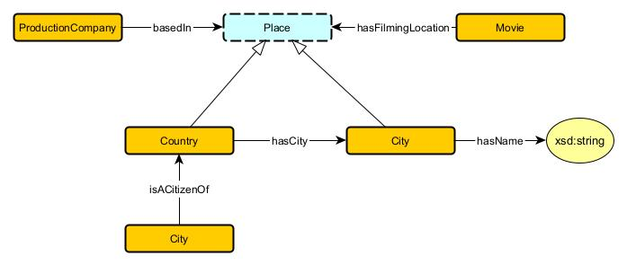

1.  `ProductionCompany basedIn min 1 Place` 

     The Production Company is based in at least one Place.  

2.  `Movie hasFilmingLocation min 1 Place` 
     The Movie has at least one filming location.  

3.  `City hasName exactly 1 xsd:String` 
     The City has exactly one name, represented as String.  

4.  `Person isACitizenOf min 1 Country` 
     The person is a citizen of at least one country. 

5.  `Country hasCity min 1 City` 
     The Country has at least one city. 

**Director** 
    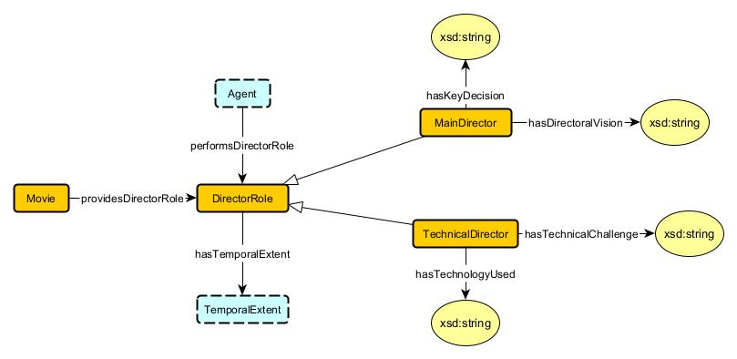

1.  `Movie providesDirectorRole min 1 DirectorRole` 
     The Movie provides at least one DirectorRole. 

2.  `Agent performsDirectorRole min 1 DirectorRole` 
     The Agent performs at least one DirectorRole. 

3.  `DirectorRole hasTemporalExtent exactly 1 TemporalExtent` 
     The DirectorRole has exactly one TemporalExtent. 

4.   `MainDirector hasKeyDecision exactly 1 xsd:string` 
      The MainDirector has exactly one directorial vision, represented as string.  

5.    `MainDirector has DirectorialVision exactly 1 xsd:string` 
       MainDirector has exactly one directorial vision, represented as string.  

6.    `TechnicalDirector hasTechnicalChallenge min 1 xsd:string` 
      The TechnicalDirector has at least one technical challenge, represented as string. 

7.    `TechnicalDirector hasTechnologyUsed min 1 xsd:string` 
       The TechnicalDirector uses at least one type of technology, represented as string.  

**Genere** 

1.  `Genere hasTargetAudience exactly 1 xsd:string` 
     The Genere has exactly one target audience, represented as string.  
        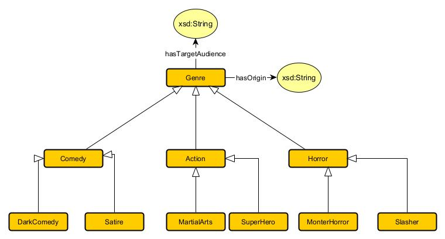

1.  `Genere hasTargetAudience exactly 1 xsd:string` 
     The Genere has exactly one target audience, represented as string.  

2.  `Genere hasOrigin exactly 1 xsd:string` 
     The Genere has exactly one origin, represented as string.  
     
3.  `Comedy subClassOf Genere` 
     `Action subClassOf Genere` 
     `Horror subClassOf Genere` 
     Comedy,Action and Horror are subclasses of Genere. 
     
4.  `DarkComedy subClassOf Comedy` 
    `Staire subClassOf Comedy` 
    DarkComedy and Staire are subclass of Comedy 

5.  `MartialArts subClassOf Action` 
    `Superhero subClassof Action` 
     MartialArts and SuperHero are subclasses of Action. 

6.  `MonsterHorror subClassOf Horror` 
     MonsterHorror is a subClass of Horror.  

**GrossEarning** 
    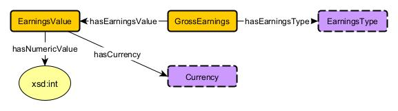

1.  `GrossEarnings hasEarningValue exactly 1 EarningValue` 
    The GrossEarnings has exactly one EarningValue.  

2.  `EarningsValue hasNumericValue exactly 1 xsd:int` 
     The EarningValue has exactly one numeric value, represented as integer.  

3.  `EarningValue hasCurrency exactly 1 currency` 
     The EarningValue has exactly one currency.  

4.  `GrossEarnings hasEarningsType exactly 1 EarningsType` 
     The GrossEarnings has exactly one type of earnings. 

**MovieRating** 
    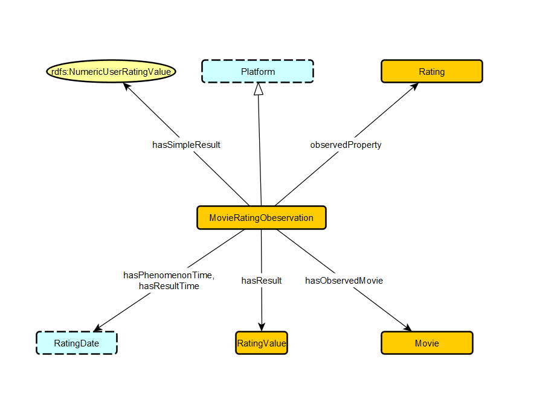

1.  `MovieRatingObservation hasSimpleResult exactly 1 rdfs:NumericUserRatingValue` 
    The MovieRatingObservation has exactly one simple result, represented as a numeric user rating value. 

2. `MovieRatingObservation observedProperty exactly 1 Rating` 
    The MovieRatingObservation observes exactly one property, which is the Rating. 

3. `MovieRatingObservation hasResult exactly 1 RatingValue`   
    The MovieRatingObservation has exactly one result, represented by a RatingValue. 

4. `MovieRatingObservation hasObservedMovie exactly 1 Movie` 
    The MovieRatingObservation is associated with exactly one observed Movie. 

5. `MovieRatingObservation hasPhenomenonTime exactly 1 RatingDate`    

    The MovieRatingObservation has exactly one phenomenon time, represented by the RatingDate. 

6. `MovieRatingObservation hasResultTime exactly 1 RatingDate` 
    The MovieRatingObservation has exactly one result time, also represented by the RatingDate. 

7.  `Platform subClassOf MovieRatingObservation` 
    The Platform is a subclass of MovieRatingObservation, indicating that MovieRatingObservation can be further refined by Platform. 

**ProducationCompany** 
    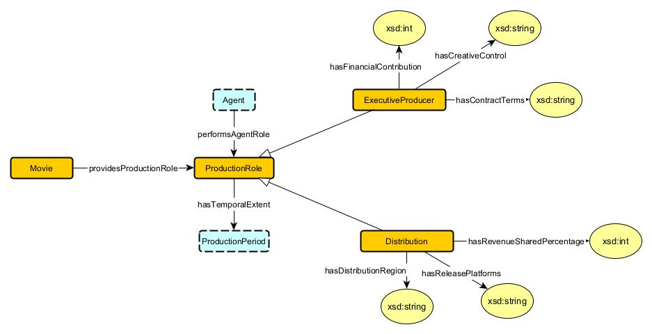

1.  `Movie providesProductionRole min 1 ProductionRole` 
     The Movie provides at least one ProductionRole. 

2. `Agent performsAgentRole exactly 1 ProductionRole` 
    The Agent performs exactly one ProductionRole. 

3. `ProductionRole hasTemporalExtent exactly 1 ProductionPeriod`   
    The ProductionRole has exactly one temporal extent, represented by the ProductionPeriod. 

4. `ExecutiveProducer hasFinancialContribution exactly 1 xsd:int` 
    The ExecutiveProducer has exactly one financial contribution, represented as an integer. 

5. `ExecutiveProducer hasCreativeControl exactly 1 xsd:string`    
    The ExecutiveProducer has exactly one creative control specification, represented as a string. 

6.  `ExecutiveProducer hasContractTerms exactly 1 xsd:int` 
    The ExecutiveProducer has exactly one contract terms specification, represented as an integer. 

7. `Distribution hasRevenueSharePercentage exactly 1 xsd:string` 
    The Distribution has exactly one revenue share percentage, represented as a string. 

8. `Distribution hasReleasePlatforms min 1 xsd:string`   
    The Distribution has at least one release platform, represented as a string. 

9. `Distribution hasDistributionRegion exactly 1 xsd:string` 
    The Distribution has exactly one distribution region, represented as a string. 

**InflationRate** 
    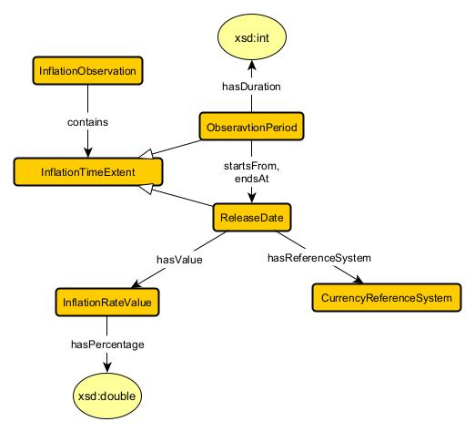

1.  `InflationObservation contains exactly 1 InflationTimeExtent` 
    The InflationObservation contains exactly one InflationTimeExtent. 

2. `ObservationPeriod hasDuration exactly 1 xsd:int` 
    The ObservationPeriod has exactly one duration, represented as an integer. 

3. `ObservationPeriod startsFrom exactly 1 ReleaseDate`   
    The ObservationPeriod has exactly one start date, represented by ReleaseDate. 

4. `ObservationPeriod endsAt exactly 1 ReleaseDate` 
    The ObservationPeriod has exactly one end date, represented by ReleaseDate. 

5. `InflationTimeExtent hasValue exactly 1 InflationRateValue`    
    The InflationTimeExtent has exactly one inflation rate value. 

6.  `InflationRateValue hasPercentage exactly 1 xsd:double` 
    The InflationRateValue has exactly one percentage value, represented as a double. 

7. `ReleaseDate hasReferenceSystem exactly 1 CurrencyReferenceSystem` 
    The ReleaseDate has exactly one reference system, represented by CurrencyReferenceSystem. 

**UserRating** 
    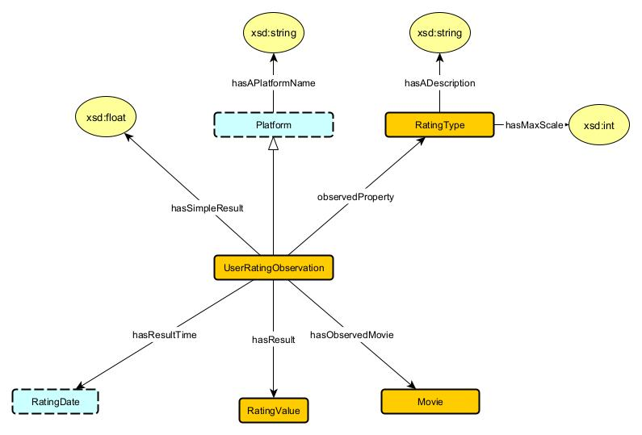

1.  `UserRatingObservation hasSimpleResult exactly 1 rdfs:NumericRatingValue` 
    The UserRatingObservation has exactly one simple result, represented by a NumericRatingValue. 

2. `UserRatingObservation observedProperty exactly 1 RatingType` 
    The UserRatingObservation observes exactly one property, which is a RatingType. 

3. `UserRatingObservation hasResult exactly 1 RatingValue`   
    The UserRatingObservation has exactly one result, represented by a RatingValue. 

4. `UserRatingObservation hasObservedMovie exactly 1 Movie` 
    The UserRatingObservation is associated with exactly one observed Movie. 

5. `UserRatingObservation hasResultTime exactly 1 RatingDate`    
    The UserRatingObservation has exactly one result time, represented by a RatingDate. 

6.  `Platform hasAPlatformName exactly 1 xsd:string` 
   The Platform has exactly one name, represented as a string. 

7. `RatingType hasADescription exactly 1 xsd:string` 
    The RatingType has exactly one description, represented as a string. 

7. `RatingType maxScale exactly 1 xsd:int` 
    The RatingType has exactly one maximum scale value, represented as an integer. 

**Vote** 
    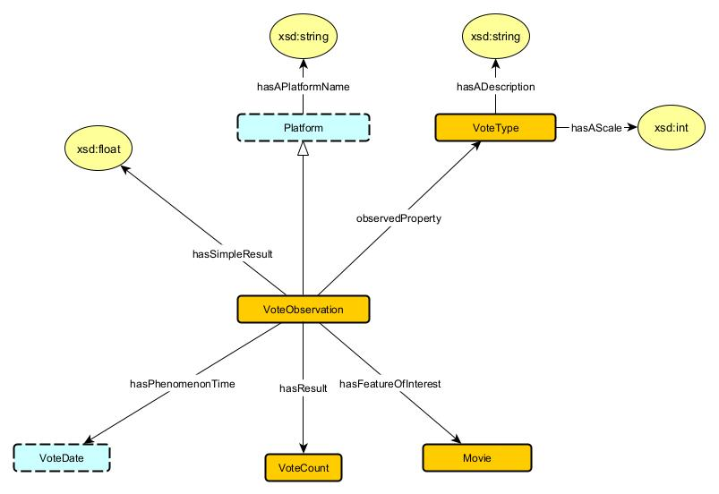

1.  `VoteObservation hasSimpleResult exactly 1 rdfs:NumericVoteValue` 
    The VoteObservation has exactly one simple result, represented by a NumericVoteValue. 

2. `VoteObservation observedProperty exactly 1 VoteType` 
    The VoteObservation observes exactly one property, which is a VoteType. 

3. `VoteObservation hasResult exactly 1 VoteCount`   
    The VoteObservation has exactly one result, represented by a VoteCount. 

4. `VoteObservation hasFeatureOfInterest exactly 1 Movie` 
    The VoteObservation has exactly one feature of interest, which is a Movie. 

5. `VoteObservation hasPhenomenonTime exactly 1 VoteDate`    
    The VoteObservation has exactly one phenomenon time, represented by a VoteDate. 

6.  `Platform hasAPlatformName exactly 1 xsd:string` 
   The Platform has exactly one platform name, represented as a string. 

7. `VoteType hasADescription exactly 1 xsd:string` 
    The VoteType has exactly one description, represented as a string. 

8. `VoteType hasAScale exactly 1 xsd:int` 
    The VoteType has exactly one scale, represented as an integer. 
