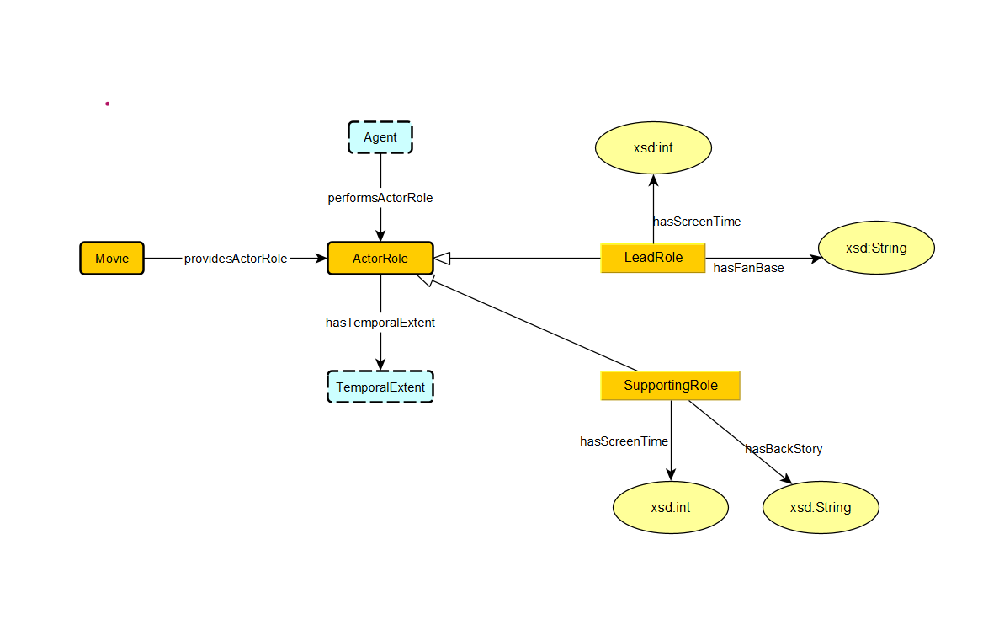

1.  `ActorRole SubClass Of AgentRole`   
     Actor roles are a type of agent role.   

2.  `providesActorRole exactly 1 ActorRole`   
     Each movie provides exactly one actor role.   
 
3.  `hasTemporalExtent exactly 1 TemporalExtent`   
     Each actor role has exactly one temporal extent.   

4.  `LeadRole SubClass Of ActorRole SupportingRole SubClass Of ActorRole`   
     Lead and supporting roles are specific types of actor roles   

5.  `hasScreenTime exactly 1 xsd:int`   
     Both lead and supporting roles have exactly one screen time attribute of type integer.   

6.  `hasFanBase exactly 1 xsd:String`   
     Each lead role has exactly one fan base attribute of type string.   

7. `hasBackStory exactly 1 xsd:String`   
    Each supporting role has exactly one backstory attribute of type string.   

8.  `performsActorRole Domain Agent`   
     Actor roles are defined within the context of agents.   

9.  `providesActorRole Domain Movie`   
     The Movie entity has a mandatory relationship with ActorRole.   
