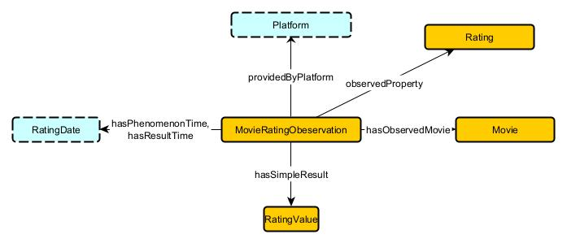

**Actor** 
     

### Axioms
1. Movie → providesActorRole → ActorRole  
     * `Movie SubClassOf providesActorRole only ActorRole`  
          The range of the relationship providesActorRole must be ActorRole.

     * `Movie SubClassOf providesActorRole some ActorRole`  
          Every Movie must provide at least one ActorRole.

2. Agent → performsActorRole → ActorRole
     * `ActorRole SubClassOf performsActorRole only Agent`  
          The range of the relationship performsActorRole must be Agent.

     * `ActorRole SubClassOf performsActorRole some Agent`  
          Every ActorRole must be performed by an Agent.

3. ActorRole → hasTemporalExtent → TemporalExtent
     * `ActorRole SubClassOf hasTemporalExtent only TemporalExtent`  
          The range of the relationship hasTemporalExtent must be TemporalExtent.

     * `ActorRole SubClassOf hasTemporalExtent some TemporalExtent`  
          Every ActorRole must have a temporal extent specifying time-related details.
     
     * `ActorRole SubClassOf ∀hasTemporalExtent.TemporalExtent`  
          All objects of the hasTemporalExtent relationship for ActorRole must be of type TemporalExtent.

4. LeadRole → hasScreenTime → xsd
     * `LeadRole SubClassOf hasScreenTime only xsd:int`  
          The range of the relationship hasScreenTime must be xsd:int.

     * `LeadRole SubClassOf hasScreenTime some xsd:int`  
          Every LeadRole must have a screen time represented as an integer.

5. LeadRole → hasFanBase → xsd
     * `LeadRole SubClassOf hasFanBase only xsd:String`  
          The range of the relationship hasFanBase must be xsd:String.

     * `LeadRole SubClassOf hasFanBase some xsd:String`  
          Every LeadRole must have a fan base represented as a string.

6. SupportingRole → hasScreenTime → xsd
     * `SupportingRole SubClassOf hasScreenTime only xsd:int`  
          The range of the relationship hasScreenTime must be xsd:int.

     * `SupportingRole SubClassOf hasScreenTime some xsd:int`  
          Every SupportingRole must have a screen time represented as an integer.

7. SupportingRole → hasBackStory → xsd
     * `SupportingRole SubClassOf hasBackStory only xsd:String`  
          The range of the relationship hasBackStory must be xsd:String.

     * `SupportingRole SubClassOf hasBackStory some xsd:String`  
          Every SupportingRole must have a backstory represented as a string.

8. LeadRole → ActorRole
     * `LeadRole SubClassOf ActorRole`  
          LeadRole is a subclass of ActorRole.

9. SupportingRole → ActorRole
     * `SupportingRole SubClassOf ActorRole`  
          SupportingRole is a subclass of ActorRole.

10. `LeadRole ⊓ SupportingRole ⊑ ⊥`  
          LeadRole and SupportingRole are disjoint classes, meaning an entity cannot belong to both classes simultaneously.

**Budget** 
    

### Axioms
1. Budget → hasQuantityKind → QuantityKind
     * `Budget SubClassOf hasQuantityKind only QuantityKind`  
          The range of the relationship hasQuantityKind must be QuantityKind.

     * `Budget SubClassOf hasQuantityKind some QuantityKind`  
          Every Budget must be associated with at least one QuantityKind.

2. Budget → hasQuantityValue → QuantityValue
     * `Budget SubClassOf hasQuantityValue only QuantityValue`  
          The range of the relationship hasQuantityValue must be QuantityValue.

     * `Budget SubClassOf hasQuantityValue some QuantityValue`  
          Every Budget must have at least one QuantityValue.

     * `Budget ⊓ QuantityValue ⊑ ⊥`  
            Budget and QuantityValue are disjoint classes, meaning an entity cannot belong to both classes simultaneously.

3. QuantityValue → hasUnit → Unit
     * `QuantityValue SubClassOf hasUnit only Unit`  
          The range of the relationship hasUnit must be Unit.

     * `QuantityValue SubClassOf hasUnit some Unit`  
          Every QuantityValue must have a unit associated with it.

4. QuantityValue → hasNumericValue → xsd
     * `QuantityValue SubClassOf hasNumericValue only xsd:double`  
          The range of the relationship hasNumericValue must be xsd:double.

     * `QuantityValue SubClassOf hasNumericValue some xsd:double`  
          Every QuantityValue must have a numeric value represented as a double.

     * `QuantityValue SubClassOf ∀hasNumericValue.xsd:double`  
          All objects of the hasNumericValue relationship for QuantityValue must be of type xsd:double.

5. `QuantityKind ⊓ Unit ⊑ ⊥`  
        QuantityKind and Unit are disjoint classes, meaning an entity cannot belong to both classes simultaneously.

6. `Budget SubClassOf ⊤`  
        Budget is a class that exists as a superclass for other relationships.

**Country** 
    

### Axioms
1. ProductionCompany → basedIn → Place
     * `ProductionCompany SubClassOf basedIn only Place`  
          The range of the relationship basedIn must be Place.

     * `ProductionCompany SubClassOf basedIn some Place`  
          Every ProductionCompany must have a base location represented as a Place.

2. Movie → hasFilmingLocation → Place
     * `Movie SubClassOf hasFilmingLocation only Place`  
          The range of the relationship hasFilmingLocation must be Place.

     * `Movie SubClassOf hasFilmingLocation some Place`  
          Every Movie must have at least one filming location represented by a Place.

3. City → Place
     * `Place SubClassOf hasCity only City`  
          The range of the relationship hasCity must be City.

     * `Place SubClassOf hasCity some City`  
          Every Place must be associated with at least one City.

     * `City SubClassOf Place`  
          A City is a subclass of Place.

4. City → hasName → xsd
     * `City SubClassOf hasName only xsd:String`  
          The range of the relationship hasName must be xsd:String.

     * `City SubClassOf hasName some xsd:String`  
          Every City must have a name represented as a string.

     * `City SubClassOf ∀hasName.xsd:String`  
          All objects of the hasName relationship for City must be of type xsd:String.

5. Person → isACitizenOf → Country
     * `Person SubClassOf isACitizenOf only Country`  
          The range of the relationship isACitizenOf must be Country.

     * `Person SubClassOf isACitizenOf some Country`  
          Every Person must be a citizen of at least one Country.

6. Country → hasCity → City
     * `Country SubClassOf hasCity only City`  
          The range of the relationship hasCity must be City.

     * `Country SubClassOf hasCity some City`   
          Every Country must have at least one associated City.

     * `City ⊓ Country ⊑ ⊥`  
          City and Country are disjoint classes, meaning an entity cannot belong to both classes simultaneously.

7. Country → Place
     * `Country SubClassOf Place`  
          A Country is a subclass of Place.

8. `ProductionCompany ⊓ Movie ⊑ ⊥`  
          ProductionCompany and Movie are disjoint classes, meaning an entity cannot belong to both classes simultaneously.

**Director** 
    

### Axioms
1. Movie → providesDirectorRole → DirectorRole
     * `Movie SubClassOf providesDirectorRole only DirectorRole`  
          The range of the relationship providesDirectorRole must be DirectorRole.

     * `Movie SubClassOf providesDirectorRole some DirectorRole`  
          Every Movie must provide at least one DirectorRole.

2. Agent → performsDirectorRole → DirectorRole
     * `DirectorRole SubClassOf performsDirectorRole only Agent`  
          The range of the relationship performsDirectorRole must be Agent.

     * `DirectorRole SubClassOf performsDirectorRole some Agent`  
          Every DirectorRole must be performed by an Agent.

3. DirectorRole → hasTemporalExtent → TemporalExtent
     * `DirectorRole SubClassOf hasTemporalExtent only TemporalExtent`  
          The range of the relationship hasTemporalExtent must be TemporalExtent.

     * `DirectorRole SubClassOf hasTemporalExtent some TemporalExtent`  
          Every DirectorRole must have a temporal extent specifying its associated time-related details.

4. MainDirector → hasKeyDecision → xsd
     * `MainDirector SubClassOf hasKeyDecision only xsd:String`  
          The range of the relationship hasKeyDecision must be xsd:String.

     * `MainDirector SubClassOf hasKeyDecision some xsd:String`  
          Every MainDirector must have key decisions represented as strings.

5. MainDirector → hasDirectorialVision → xsd
     * `MainDirector SubClassOf hasDirectorialVision only xsd:String`  
          The range of the relationship hasDirectorialVision must be xsd:String.

     * `MainDirector SubClassOf hasDirectorialVision some xsd:String`  
          Every MainDirector must have a directorial vision represented as a string.

6. TechnicalDirector → hasTechnologyUsed → xsd
     * `TechnicalDirector SubClassOf hasTechnologyUsed only xsd:String`  
          The range of the relationship hasTechnologyUsed must be xsd:String.

     * `TechnicalDirector SubClassOf hasTechnologyUsed some xsd:String`  
          Every TechnicalDirector must have technologies used represented as strings.

7. TechnicalDirector → hasTechnicalChallenged → xsd
     * `TechnicalDirector SubClassOf hasTechnicalChallenge only xsd:String`  
          The range of the relationship hasTechnicalChallenge must be xsd:String.

     * `TechnicalDirector SubClassOf hasTechnicalChallenge some xsd:String`  
          Every TechnicalDirector must have technical challenges represented as strings.

8. MainDirector → DirectorRole
     * `MainDirector SubClassOf DirectorRole`  
          A MainDirector is a subclass of DirectorRole.

9. TechnicalDirector → DirectorRole
     * `TechnicalDirector SubClassOf DirectorRole`  
          A TechnicalDirector is a subclass of DirectorRole.

10. `MainDirector ⊓ TechnicalDirector ⊑ ⊥`  
          MainDirector and TechnicalDirector are disjoint classes, meaning an entity cannot belong to both classes simultaneously.

**Genre** 
 

### Axioms
1. Genre → hasTargetAudience → xsd
     * `Genre SubClassOf hasTargetAudience only xsd:String`  
          The range of the relationship hasTargetAudience must be xsd:String.

     * `Genre SubClassOf hasTargetAudience some xsd:String`  
          Every Genre must have a target audience represented as a string.

     * `Genre SubClassOf ≤1hasTargetAudience`  
          Each Genre can have at most one hasTargetAudience relationship.

2. Genre → hasOrigin → xsd
     * `Genre SubClassOf hasOrigin only xsd:String`  
          The range of the relationship hasOrigin must be xsd:String.

     * `Genre SubClassOf hasOrigin some xsd:String`  
          Every Genre must have an origin represented as a string.

     * `Genre SubClassOf ≤1hasOrigin`  
          Each Genre can have at most one hasOrigin relationship.

3. Comedy → Genre
     * `Comedy SubClassOf Genre`  
          A Comedy is a subclass of Genre.

4. Action → Genre
     * `Action SubClassOf Genre`  
          An Action is a subclass of Genre.

5. Horror → Genre
     * `Horror SubClassOf Genre`  
          A Horror is a subclass of Genre.

6. DarkComedy → Comedy
     * `DarkComedy SubClassOf Comedy`  
          DarkComedy is a subclass of Comedy.

7. Satire → Comedy
     * `Satire SubClassOf Comedy`  
          Satire is a subclass of Comedy.

8. MaritalArts → Action
     * `MartialArts SubClassOf Action`  
          MartialArts is a subclass of Action.

9. Superhero → Action
     * `Superhero SubClassOf Action`  
          Superhero is a subclass of Action.

10. MonsterHorror → Horror
     * `MonsterHorror SubClassOf Horror`  
          MonsterHorror is a subclass of Horror.

11. Slasher → Horror
     * `Slasher SubClassOf Horror`  
          Slasher is a subclass of Horror.

12. `Comedy ⊓ Action ⊑ ⊥`  
          Comedy and Action are disjoint classes, meaning an entity cannot belong to both classes simultaneously.

13. `Comedy ⊓ Horror ⊑ ⊥`  
          Comedy and Horror are disjoint classes.

14. `Action ⊓ Horror ⊑ ⊥`  
         Action and Horror are disjoint classes.

15. `DarkComedy ⊓ Satire ⊑ ⊥`  
          DarkComedy and Satire are disjoint subclasses of Comedy.

16. `MartialArts ⊓ Superhero ⊑ ⊥`  
          MartialArts and Superhero are disjoint subclasses of Action.

17. `MonsterHorror ⊓ Slasher ⊑ ⊥`  
          MonsterHorror and Slasher are disjoint subclasses of Horror.

18. `Comedy SubClassOf hasTargetAudience some xsd:String`  
          Every Comedy genre must have a target audience.

19. `Action SubClassOf hasOrigin some xsd:String`  
          Every Action genre must have an origin.

20. `Horror SubClassOf hasTargetAudience some xsd:String`  
          Every Horror genre must have a target audience.

**GrossEarning** 
    

### Axioms
1. GrossEarnings → hasEarningsValue → EarningsValue
     * `GrossEarnings SubClassOf hasEarningsValue only EarningsValue`  
          The range of the relationship hasEarningsValue must be EarningsValue.

     * `GrossEarnings SubClassOf hasEarningsValue some EarningsValue`  
          Every GrossEarnings must have at least one associated EarningsValue.

2. GrossEarnings → hasEarningsType → EarningsType
     * `GrossEarnings SubClassOf hasEarningsType only EarningsType`  
          The range of the relationship hasEarningsType must be EarningsType.

     * `GrossEarnings SubClassOf hasEarningsType some EarningsType`  
          Every GrossEarnings must have an associated EarningsType.

3. EarningsValue → hasNumericValue → xsd
     * `EarningsValue SubClassOf hasNumericValue only xsd:int`  
          The range of the relationship hasNumericValue must be xsd:int.

     * `EarningsValue SubClassOf hasNumericValue some xsd:int`  
          Every EarningsValue must have a numeric value represented as an integer.

4. EarningsValue → hasCurrency → Currency
     * `EarningsValue SubClassOf hasCurrency only Currency`  
          The range of the relationship hasCurrency must be Currency.

     * `EarningsValue SubClassOf hasCurrency some Currency`  
          Every EarningsValue must have an associated Currency.

**MovieRating** 
    

### Axioms
1. MovieRatingObservation → observedProperty → Rating
     * `MovieRatingObservation SubClassOf observedProperty only Rating`  
          The range of the relationship observedProperty must be Rating.

     * `MovieRatingObservation SubClassOf observedProperty some Rating`  
          Every MovieRatingObservation must observe at least one Rating.

2. MovieRatingObservation → hasSimpleResult → rdfs:NumericUserRatingValue
     * `MovieRatingObservation SubClassOf hasSimpleResult only rdfs:NumericUserRatingValue`  
          The range of the relationship hasSimpleResult must be rdfs:NumericUserRatingValue.

     * `MovieRatingObservation SubClassOf hasSimpleResult some rdfs:NumericUserRatingValue`  
          Every MovieRatingObservation must have a simple result represented as a numeric user rating value.

3. MovieRatingObservation → hasPhenomenonTime → RatingDate
     * `MovieRatingObservation SubClassOf hasPhenomenonTime only RatingDate`  
          The range of the relationship hasPhenomenonTime must be RatingDate.

4. MovieRatingObservation → hasResultTime → RatingDate
     * `MovieRatingObservation SubClassOf hasResultTime only RatingDate`  
          The range of the relationship hasResultTime must be RatingDate.

5. `MovieRatingObservation SubClassOf hasPhenomenonTime some RatingDate and hasResultTime some RatingDate`  
          Every MovieRatingObservation must have a phenomenon time and a result time represented as a RatingDate.

6. `⊤ SubClassOf ≤1hasPhenomenonTime`  
          Each MovieRatingObservation can have at most one hasPhenomenonTime relationship.

7. MovieRatingObservation → hasResult → RatingValue
     * `MovieRatingObservation SubClassOf hasResult only RatingValue`  
          The range of the relationship hasResult must be RatingValue.

     * `MovieRatingObservation SubClassOf hasResult some RatingValue`  
          Every MovieRatingObservation must have a result represented by a RatingValue.

8. MovieRatingObservation → hasObservedMovie → Movie
     * `MovieRatingObservation SubClassOf hasObservedMovie only Movie`  
          The range of the relationship hasObservedMovie must be Movie.

     * `MovieRatingObservation SubClassOf hasObservedMovie some Movie`  
          Every MovieRatingObservation must be associated with at least one observed Movie.

9.   * `Platform SubClassOf hasAPlatformName only xsd:String` 
          The range of the relationship `hasAPlatformName` must be `xsd:String`.

10.  * `Platform SubClassOf hasAPlatformName some xsd:String` 
          Every `Platform` must have a name represented as a string.

**ProducationCompany** 
    

### Axioms
1. Movie → providesProductionRole → ProductionRole
     * `Movie SubClassOf providesProductionRole only ProductionRole`  
          The range of the relationship providesProductionRole must be ProductionRole.

     * `Movie SubClassOf providesProductionRole some ProductionRole`  
          Every Movie must provide at least one ProductionRole.

2. ProductionRole → hasTemporalExtent → ProductionPeriod
     * `ProductionRole SubClassOf hasTemporalExtent only ProductionPeriod`  
          The range of the relationship hasTemporalExtent must be ProductionPeriod.

     * `ProductionRole SubClassOf hasTemporalExtent some ProductionPeriod`  
          Every ProductionRole must have a temporal extent specifying its associated ProductionPeriod.

3. Agent → performsAgentRole → ProductionRole
     * `ProductionRole SubClassOf performedBy only Agent`  
          The range of the relationship performedBy must be Agent.

     * `ProductionRole SubClassOf performedBy some Agent`  
          Every ProductionRole must be performed by an Agent.

4. ExecutiveProducer → hasFinancialContribution → xsd
     * `ExecutiveProducer SubClassOf hasFinancialContribution only xsd:int`  
          The range of the relationship hasFinancialContribution must be xsd:int.

     * `ExecutiveProducer SubClassOf hasFinancialContribution some xsd:int`  
          Every ExecutiveProducer must have a financial contribution represented as an integer.

5. ExecutiveProducer → hasCreativeControl → xsd
     * `ExecutiveProducer SubClassOf hasCreativeControl only xsd:String`  
          The range of the relationship hasCreativeControl must be xsd:String.

     * `ExecutiveProducer SubClassOf hasCreativeControl some xsd:String`  
          Every ExecutiveProducer must have creative control represented as a string.

6. ExecutiveDirector → hasContractTerms → xsd
     * `ExecutiveProducer SubClassOf hasContractTerms only xsd:int`  
          The range of the relationship hasContractTerms must be xsd:int.

     * `ExecutiveProducer SubClassOf hasContractTerms some xsd:int`  
          Every ExecutiveProducer must have contract terms represented as an integer.

7. Distribution → hasRevenueSharePercentage → xsd
     * `Distribution SubClassOf hasRevenueSharePercentage only xsd:int`  
          The range of the relationship hasRevenueSharePercentage must be xsd:int.

     * `Distribution SubClassOf hasRevenueSharePercentage some xsd:int`  
          Every Distribution must have a revenue share percentage represented as an integer.

8. Distribution → hasDistributionRegion → xsd
     * `Distribution SubClassOf hasDistributionRegion only xsd:String`  
          The range of the relationship hasDistributionRegion must be xsd:String.

     * `Distribution SubClassOf hasDistributionRegion some xsd:String`  
          Every Distribution must have a distribution region represented as a string.

9. Distribution → hasReleasePlatforms → xsd
     * `Distribution SubClassOf hasReleasePlatforms only xsd:String`  
          The range of the relationship hasReleasePlatforms must be xsd:String.

     * `Distribution SubClassOf hasReleasePlatforms some xsd:String`  
          Every Distribution must have release platforms represented as a string.

**InflationRate** 
    

### Axioms
1. InflationObservation → contains → InflationTimeExtent
     * `InflationObservation SubClassOf contains only InflationTimeExtent`  
          The range of the relationship contains must be InflationTimeExtent.

     * `InflationObservation SubClassOf contains some InflationTimeExtent`  
          Every InflationObservation must contain at least one InflationTimeExtent.

2. ObservationPeriod → InflationTimeExtent
     * `InflationTimeExtent SubClassOf hasDuration only ObservationPeriod`  
          The range of the relationship hasDuration must be ObservationPeriod.

3.   *  `InflationTimeExtent SubClassOf hasDuration some ObservationPeriod` 
          Every `InflationTimeExtent` must have a duration represented by an `ObservationPeriod`.

3. ObservationPeriod → startsFrom → ReleaseDate
     * `ObservationPeriod SubClassOf startsFrom only ReleaseDate`  
          The range of the relationship startsFrom must be ReleaseDate.

4. ObservationPeriod → endsAt → ReleaseDate
     * `ObservationPeriod SubClassOf endsAt only ReleaseDate`  
          The range of the relationship endsAt must be ReleaseDate.

     *  `ObservationPeriod SubClassOf startsFrom some ReleaseDate and endsAt some ReleaseDate` 
          Every `ObservationPeriod` must have a starting and an ending point represented by `ReleaseDate`.

     *  `InflationTimeExtent SubClassOf hasValue only InflationRateValue` 
          The range of the relationship `hasValue` must be `InflationRateValue`.

     *  `InflationTimeExtent SubClassOf hasValue some InflationRateValue` 
          Every `InflationTimeExtent` must have a value represented by an `InflationRateValue`.

6. InflationRateValue → hasPercentage → xsd
     * `InflationRateValue SubClassOf hasPercentage only xsd:double`  
          The range of the relationship hasPercentage must be xsd:double.

     * `InflationRateValue SubClassOf hasPercentage some xsd:double`  
          Every InflationRateValue must have a percentage represented as a double.

7. ReleaseDate → hasReferenceSystem → CurrencyReferenceSyatem
     * `ReleaseDate SubClassOf hasReferenceSystem only CurrencyReferenceSystem`  
          The range of the relationship hasReferenceSystem must be CurrencyReferenceSystem.

     * `ReleaseDate SubClassOf hasReferenceSystem some CurrencyReferenceSystem`  
          Every ReleaseDate must have a reference system associated with a CurrencyReferenceSystem.

**UserRating** 
    

### Axioms
1. UserRatingObservation → observedProperty → RatingType
     * `UserRatingObservation SubClassOf observedProperty only RatingType`  
          The range of the relationship observedProperty must be RatingType.

     * `UserRatingObservation SubClassOf observedProperty some RatingType`  
          Every UserRatingObservation must observe at least one RatingType.

2. UserRatingObservation → hasSimpleResult → rdfs:NumericRatingValue
     * `UserRatingObservation SubClassOf hasSimpleResult only rdfs:NumericRatingValue`  
          The range of the relationship hasSimpleResult must be rdfs:NumericRatingValue.

     * `UserRatingObservation SubClassOf hasSimpleResult some rdfs:NumericRatingValue`  
          Every UserRatingObservation must have a simple result as a numeric rating value.

3. UserRatingObservation → hasResultTime → RatingDate
     * `UserRatingObservation SubClassOf hasResultTime only RatingDate`  
          The range of the relationship hasResultTime must be RatingDate.

     * `UserRatingObservation SubClassOf hasResultTime some RatingDate`  
          Every UserRatingObservation must have a result time as a RatingDate.

     * `UserRatingObservation SubClassOf hasResultTime max 1 RatingDate`  
          Each UserRatingObservation can have at most one hasResultTime relationship.

4. UserRatingObservation → hasResult → RatingValue
     * `UserRatingObservation SubClassOf hasResult only RatingValue`  
          The range of the relationship hasResult must be RatingValue.

     * `UserRatingObservation SubClassOf hasResult some RatingValue`  
          Every UserRatingObservation must have a result represented by a RatingValue.

5. UserRatingObservation → hasObservedMovie → Movie
     * `UserRatingObservation SubClassOf hasObservedMovie only Movie`  
          The range of the relationship hasObservedMovie must be Movie.

     * `UserRatingObservation SubClassOf hasObservedMovie some Movie`  
          Every UserRatingObservation must observe at least one Movie.

6. Platform → hasAPlatformName → xsd
     * `Platform SubClassOf hasAPlatformName only xsd:String`  
          The range of the relationship hasAPlatformName must be xsd:String.

     * `Platform SubClassOf hasAPlatformName some xsd:String`  
          Every Platform must have a platform name represented as a string.

7. RatingType → hasADescription → xsd
     * `RatingType SubClassOf hasADescription only xsd:String`  
          The range of the relationship hasADescription must be xsd:String.

     * `RatingType SubClassOf hasADescription some xsd:String`  
          Every RatingType must have a description represented as a string.

8. RatingType → hasMaxScale → xsd
     * `RatingType SubClassOf hasMaxScale only xsd:int`  
          The range of the relationship hasMaxScale must be xsd:int.

     * `RatingType SubClassOf hasMaxScale some xsd:int`  
          Every RatingType must have a maximum scale represented as an integer.

**Vote** 
    

### Axioms
1. VoteObservation → observedProperty → VoteType
     * `VoteObservation SubClassOf observedProperty only VoteType`  
          The range of the relationship observedProperty must be VoteType.

     * `VoteObservation SubClassOf observedProperty some VoteType`  
          Every VoteObservation must observe at least one VoteType.

2. VoteObservation → hasSimpleResult → rdfs:NumericVoteValue
     * `VoteObservation SubClassOf hasSimpleResult only rdfs:NumericVoteValue`  
          The range of the relationship hasSimpleResult must be rdfs:NumericVoteValue.

     * `VoteObservation SubClassOf hasSimpleResult some rdfs:NumericVoteValue`  
          Every VoteObservation must have a simple result.

3. VoteObservation → hasPhenomenonTime → VoteDate
     * `VoteObservation SubClassOf hasPhenomenonTime only VoteDate`  
          The range of the relationship hasPhenomenonTime must be VoteDate.

     * `VoteObservation SubClassOf hasPhenomenonTime some VoteDate`  
          Every VoteObservation must have a phenomenon time.

     * `VoteObservation SubClassOf hasPhenomenonTime max 1 VoteDate`  
          Each VoteObservation can have at most one phenomenon time.

4. VoteObservation → hasResult → VoteCount
     * `VoteObservation SubClassOf hasResult only VoteCount`  
          The range of the relationship hasResult must be VoteCount.

     * `VoteObservation SubClassOf hasResult some VoteCount`  
          Every VoteObservation must have a result.

5. VoteObservation → hasFeatureOfInterest → Movie
     * `VoteObservation SubClassOf hasFeatureOfInterest only Movie`  
          The range of the relationship hasFeatureOfInterest must be Movie.

     * `VoteObservation SubClassOf hasFeatureOfInterest some Movie`  
          Every VoteObservation must have a feature of interest.

6. Platform → hasAPlatformName → xsd
     * `Platform SubClassOf hasAPlatformName only xsd:String`  
          The range of the relationship hasAPlatformName must be xsd:String.
       
     * `Platform SubClassOf hasAPlatformName some xsd:String`  
          Every Platform must have a platform name.

7. VoteType → hasADescription → xsd
     * `VoteType SubClassOf hasADescription only xsd:String`  
          The range of the relationship hasADescription must be xsd:String.

     * `VoteType SubClassOf hasADescription some xsd:String`  
          Every VoteType must have a description.

8. VoteType → hasAScale → xsd
     * `VoteType SubClassOf hasAScale only xsd:int`  
          The range of the relationship hasAScale must be xsd:int.

     * `VoteType SubClassOf hasAScale some xsd:int`  
          Every VoteType must have a scale.

