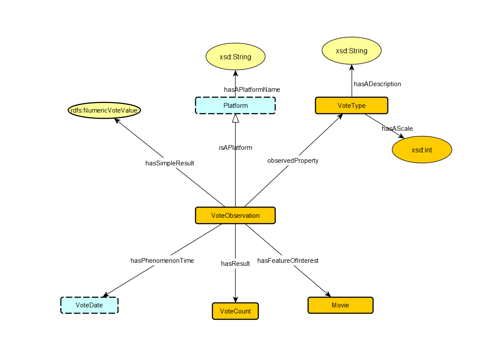

**Actor**
     

1.  `ActorRole SubClass Of AgentRole`   
     Actor roles are a type of agent role.   

2.  `providesActorRole exactly 1 ActorRole`   
     Each movie provides exactly one actor role.   
 
3.  `hasTemporalExtent exactly 1 TemporalExtent`   
     Each actor role has exactly one temporal extent.   

4.  `LeadRole SubClass Of ActorRole SupportingRole SubClass Of ActorRole`   
     Lead and supporting roles are specific types of actor roles   

5.  `hasScreenTime exactly 1 xsd:int`   
     Both lead and supporting roles have exactly one screen time attribute of type integer.   

6.  `hasFanBase exactly 1 xsd:String`   
     Each lead role has exactly one fan base attribute of type string.   

7. `hasBackStory exactly 1 xsd:String`   
    Each supporting role has exactly one backstory attribute of type string.   

8.  `performsActorRole Domain Agent`   
     Actor roles are defined within the context of agents.   

9.  `providesActorRole Domain Movie`   
     The Movie entity has a mandatory relationship with ActorRole.   

**Budget**
    

1. `Budget hasQuantityValue exactly 1 QuantityValue` 
    Every Budget has exactly one QuantityValue
    
2. `QuantityValue hasQuantityKind exactly 1 QuantityKind`
    Every QuantityValue has exactly one QuantityKind

3.  `QuantityValue hasUnit exactly 1 Unit`
     Every QuantityValue has exactly one Unit. 
    
4.  `QuantityValue hasNumericValue exactly 1 xsd:double`
     Every QuantityValue has exactly one numeric value of type xsd:double. 

**Country**
    

1.  `ProductionCompany basedIn min 1 Place`
     The Production Company is based in at least one Place. 

2.  `Movie hasFilmingLocation min 1 Place`
     The Movie has at least one filming location. 

3.  `City hasName exactly 1 xsd:String`
     The City has exactly one name, represented as String. 

4.  `Person isACitizenOf min 1 Country`
     The person is a citizen of at least one country.

5.  `Country hasCity min 1 City`
     The Country has at least one city.

**Director**
    

1.  `Movie providesDirectorRole min 1 DirectorRole`
     The Movie provides at least one DirectorRole.

2.  `Agent performsDirectorRole min 1 DirectorRole`
     The Agent performs at least one DirectorRole.

3.  `DirectorRole hasTemporalExtent exactly 1 TemporalExtent`
     The DirectorRole has exactly one TemporalExtent.

4.   `MainDirector hasKeyDecision exactly 1 xsd:string`
      The MainDirector has exactly one directorial vision, represented as string. 

5.    `MainDirector has DirectorialVision exactly 1 xsd:string`
       MainDirector has exactly one directorial vision, represented as string. 

6.    `TechnicalDirector hasTechnicalChallenge min 1 xsd:string`
      The TechnicalDirector has at least one technical challenge, represented as string.

7.    `TechnicalDirector hasTechnologyUsed min 1 xsd:string`
       The TechnicalDirector uses at least one type of technology, represented as string. 

**Genere**
        

1.  `Genere hasTargetAudience exactly 1 xsd:string`
     The Genere has exactly one target audience, represented as string. 

2.  `Genere hasOrigin exactly 1 xsd:string`
     The Genere has exactly one origin, represented as string. 
3.  `Comedy subClassOf Genere`
     `Action subClassOf Genere`
     `Horror subClassOf Genere`
     Comedy,Action and Horror are subclasses of Genere.
4.  `DarkComedy subClassOf Comedy`
    `Staire subClassOf Comedy`
    DarkComedy and Staire are subclass of Comedy

5.  `MartialArts subClassOf Action`
    `Superhero subClassof Action`
     MartialArts and SuperHero are subclasses of Action.

6.  `MonsterHorror subClassOf Horror`
     MonsterHorror is a subClass of Horror. 

**GrossEarning**
    

1.  `GrossEarnings hasEarningValue exactly 1 EarningValue`
    The GrossEarnings has exactly one EarningValue. 

2.  `EarningsValue hasNumericValue exactly 1 xsd:int`
     The EarningValue has exactly one numeric value, represented as integer. 

3.  `EarningValue hasCurrency exactly 1 currency`
     The EarningValue has exactly one currency. 

4.  `GrossEarnings hasEarningsType exactly 1 EarningsType`
     The GrossEarnings has exactly one type of earnings.

**MovieRating**
    

1.  `MovieRatingObservation hasSimpleResult exactly 1 rdfs:NumericUserRatingValue`
    The MovieRatingObservation has exactly one simple result, represented as a numeric user rating value.

2. `MovieRatingObservation observedProperty exactly 1 Rating`
    The MovieRatingObservation observes exactly one property, which is the Rating.

3. `MovieRatingObservation hasResult exactly 1 RatingValue`  
    The MovieRatingObservation has exactly one result, represented by a RatingValue.

4. `MovieRatingObservation hasObservedMovie exactly 1 Movie`
    The MovieRatingObservation is associated with exactly one observed Movie.

5. `MovieRatingObservation hasPhenomenonTime exactly 1 RatingDate`   
    The MovieRatingObservation has exactly one phenomenon time, represented by the RatingDate.

6. `MovieRatingObservation hasResultTime exactly 1 RatingDate`
    The MovieRatingObservation has exactly one result time, also represented by the RatingDate.

7.  `Platform subClassOf MovieRatingObservation`
    The Platform is a subclass of MovieRatingObservation, indicating that MovieRatingObservation can be further refined by Platform.

**ProducationCompany**
    

1.  `Movie providesProductionRole min 1 ProductionRole`
     The Movie provides at least one ProductionRole.

2. `Agent performsAgentRole exactly 1 ProductionRole`
    The Agent performs exactly one ProductionRole.

3. `ProductionRole hasTemporalExtent exactly 1 ProductionPeriod`  
    The ProductionRole has exactly one temporal extent, represented by the ProductionPeriod.

4. `ExecutiveProducer hasFinancialContribution exactly 1 xsd:int`
    The ExecutiveProducer has exactly one financial contribution, represented as an integer.

5. `ExecutiveProducer hasCreativeControl exactly 1 xsd:string`   
    The ExecutiveProducer has exactly one creative control specification, represented as a string.

6.  `ExecutiveProducer hasContractTerms exactly 1 xsd:int`
    The ExecutiveProducer has exactly one contract terms specification, represented as an integer.

7. `Distribution hasRevenueSharePercentage exactly 1 xsd:string`
    The Distribution has exactly one revenue share percentage, represented as a string.

8. `Distribution hasReleasePlatforms min 1 xsd:string`  
    The Distribution has at least one release platform, represented as a string.

9. `Distribution hasDistributionRegion exactly 1 xsd:string`
    The Distribution has exactly one distribution region, represented as a string.

**InflationRate**
    

1.  `InflationObservation contains exactly 1 InflationTimeExtent`
    The InflationObservation contains exactly one InflationTimeExtent.

2. `ObservationPeriod hasDuration exactly 1 xsd:int`
    The ObservationPeriod has exactly one duration, represented as an integer.

3. `ObservationPeriod startsFrom exactly 1 ReleaseDate`  
    The ObservationPeriod has exactly one start date, represented by ReleaseDate.

4. `ObservationPeriod endsAt exactly 1 ReleaseDate`
    The ObservationPeriod has exactly one end date, represented by ReleaseDate.

5. `InflationTimeExtent hasValue exactly 1 InflationRateValue`   
    The InflationTimeExtent has exactly one inflation rate value.

6.  `InflationRateValue hasPercentage exactly 1 xsd:double`
    The InflationRateValue has exactly one percentage value, represented as a double.

7. `ReleaseDate hasReferenceSystem exactly 1 CurrencyReferenceSystem`
    The ReleaseDate has exactly one reference system, represented by CurrencyReferenceSystem.

**UserRating**
    

1.  `UserRatingObservation hasSimpleResult exactly 1 rdfs:NumericRatingValue`
    The UserRatingObservation has exactly one simple result, represented by a NumericRatingValue.

2. `UserRatingObservation observedProperty exactly 1 RatingType`
    The UserRatingObservation observes exactly one property, which is a RatingType.

3. `UserRatingObservation hasResult exactly 1 RatingValue`  
    The UserRatingObservation has exactly one result, represented by a RatingValue.

4. `UserRatingObservation hasObservedMovie exactly 1 Movie`
    The UserRatingObservation is associated with exactly one observed Movie.

5. `UserRatingObservation hasResultTime exactly 1 RatingDate`   
    The UserRatingObservation has exactly one result time, represented by a RatingDate.

6.  `Platform hasAPlatformName exactly 1 xsd:string`
   The Platform has exactly one name, represented as a string.

7. `RatingType hasADescription exactly 1 xsd:string`
    The RatingType has exactly one description, represented as a string.

7. `RatingType maxScale exactly 1 xsd:int`
    The RatingType has exactly one maximum scale value, represented as an integer.

**Vote**
    

1.  `VoteObservation hasSimpleResult exactly 1 rdfs:NumericVoteValue`
    The VoteObservation has exactly one simple result, represented by a NumericVoteValue.

2. `VoteObservation observedProperty exactly 1 VoteType`
    The VoteObservation observes exactly one property, which is a VoteType.

3. `VoteObservation hasResult exactly 1 VoteCount`  
    The VoteObservation has exactly one result, represented by a VoteCount.

4. `VoteObservation hasFeatureOfInterest exactly 1 Movie`
    The VoteObservation has exactly one feature of interest, which is a Movie.

5. `VoteObservation hasPhenomenonTime exactly 1 VoteDate`   
    The VoteObservation has exactly one phenomenon time, represented by a VoteDate.

6.  `Platform hasAPlatformName exactly 1 xsd:string`
   The Platform has exactly one platform name, represented as a string.

7. `VoteType hasADescription exactly 1 xsd:string`
    The VoteType has exactly one description, represented as a string.

8. `VoteType hasAScale exactly 1 xsd:int`
    The VoteType has exactly one scale, represented as an integer.
